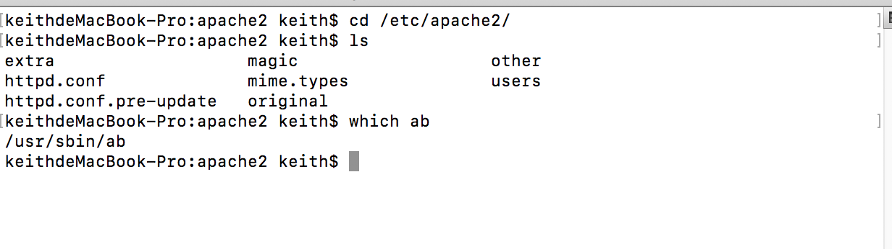
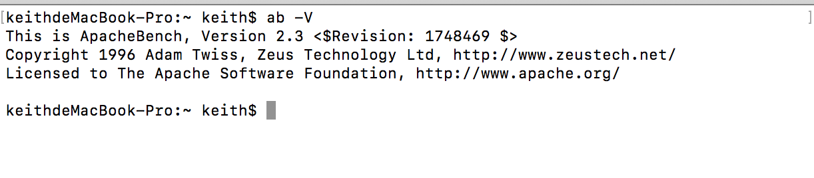
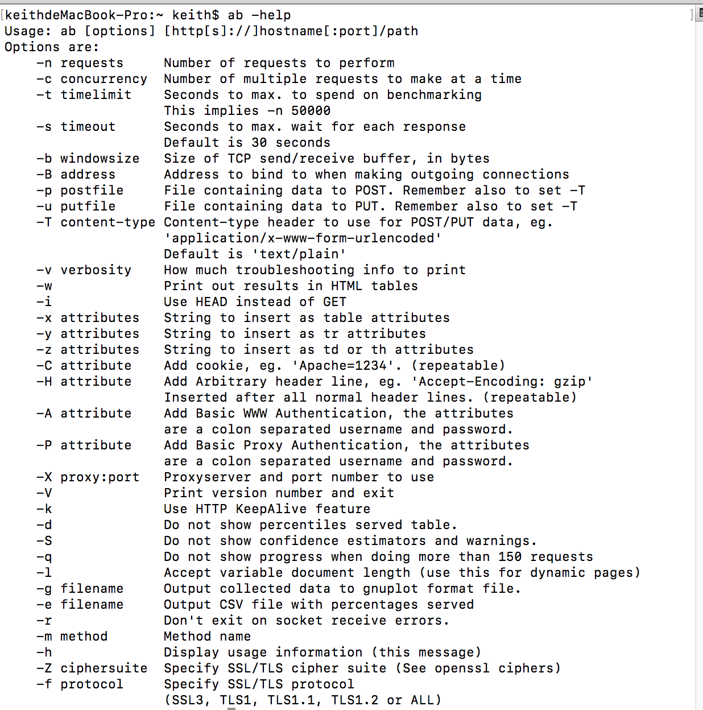
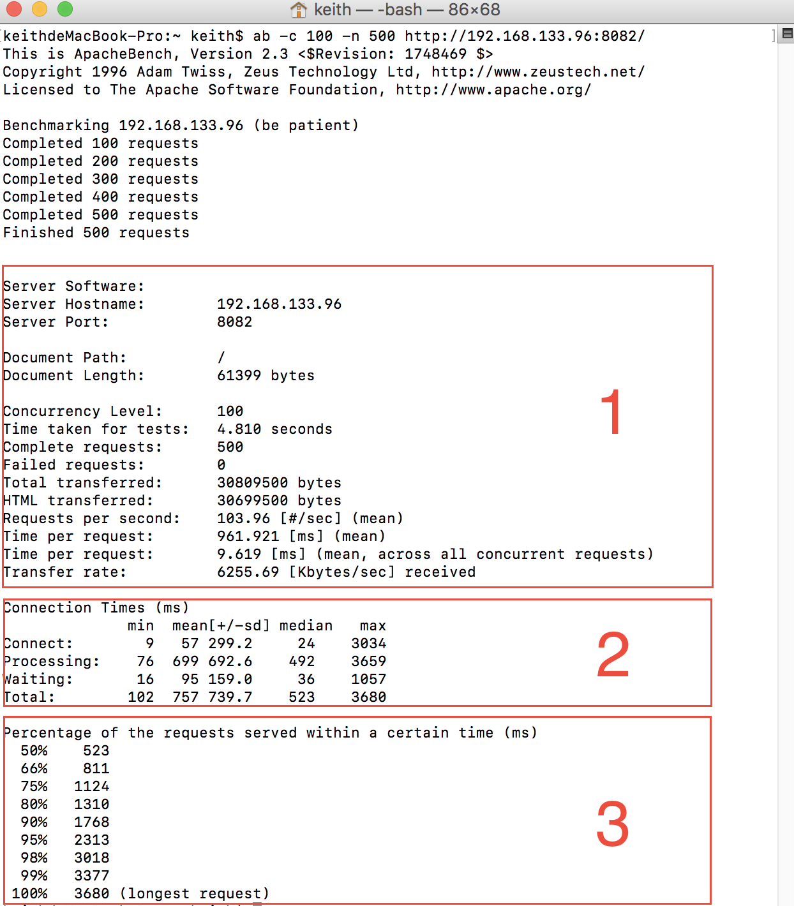

#ApacheBench(ab)测试工具

###一、ab的原理
ab是apachebench命令的缩写。

ab的原理：ab命令会创建多个并发访问线程，模拟多个访问者同时对某一URL地址进行访问。它的测试目标是基于URL的，因此，它既可以用来测试apache的负载压力，也可以测试nginx、lighthttp、tomcat、IIS等其它Web服务器的压力。

ab命令对发出负载的计算机要求很低，它既不会占用很高CPU，也不会占用很多内存。但却会给目标服务器造成巨大的负载，其原理类似CC攻击。自己测试使用也需要注意，否则一次上太多的负载。可能造成目标服务器资源耗完，严重时甚至导致死机。

###二、ab的安装

1、os x系统自带apache,存放在`/ect`目录下，ab命令默认存放在`/usr/sbin`目录下，如下：

查看ab的版本使用命令`ab -V`

2、windows平台下，我们也可以下载对应的apache版本进行安装。

目前apache最新版2.4.10，apache官网已经没有windows下载的版本。但是我们可以下载apache官网提供的集成软件包。
[点击下载](http://apache.fayea.com/httpd/binaries/win32/)

###三、ab参数说明

有关ab命令的使用，我们可以通过帮助命令进行查看。如下：

`ab --help`

参数说明

	-n 	执行的请求个数，默认执行一个请求
	-c 	一次产生的请求个数，默认是一次一个
	-t 测试所进行的最大秒数。其内部隐含值是-n 50000，它可以使对服务器的测试限制在一个固定的总时间以内。
	默认时，没有时间限制。
	-s 等待响应时间，默认是30秒。
	-b TCP发送/接收缓冲区的大小,以字节为单位。
	-p 包含了需要POST的数据的文件。
	-u 包含了需要PUT的数据的文件。
	-T POST数据所使用的Content-type头信息。
	-v 设置显示信息的详细程度-4或更大值会显示头信息，3或更大值可以显示响应代码(404,200等),
	2或更大值可以显示警告和其他信息。
	-w 以HTML表的格式输出结果。默认时，它是白色背景的两列宽度的一张表。
	-i 执行HEAD请求，而不是GET。
	-x 设置<table>属性的字符串。
	-y 设置<tr>属性的字符串。
	-z 设置<td>属性的字符串。
	-C 对请求附加一个Cookie:行。其典型形式是name=value的一个参数对，此参数可以重复。
	-H 对请求附加额外的头信息。此参数的典型形式是一个有效的头信息行，其中包含了以冒号分隔的字段和值的对
	(如,"Accept-Encoding:zip/zop;8bit")。
	-A	对服务器提供BASIC认证信任。用户名和密码由一个:隔开，并以base64编码形式发送。无论服务器是否需要(即,是
	否发送了401认证需求代码)，此字符串都会被发送。
	-P	对一个中转代理提供BASIC认证信任。用户名和密码由一个:隔开，并以base64编码形式发送。无论服务器是否需要
	(即, 是否发送了401认证需求代码)，此字符串都会被发送。
	-X	请求使用代理服务器。
	-V	显示版本号并退出。
	-k	启用HTTP KeepAlive功能，即在一个HTTP会话中执行多个请求。默认时，不启用KeepAlive功能
	-d	不显示"percentage served within XX [ms] table"的消息(为以前的版本提供支持)。
	-S	不显示confidence estimators和警告。
	-q 	如果处理的请求数大于150，ab每处理大约10%或者100个请求时，会在stderr输出一个进度计数。此-q标记可以抑
	制这些信息。
	-l 接受文档的长度
	-g	把所有测试结果写入一个'gnuplot'或者TSV(以Tab分隔的)文件。此文件可以方便地导入到
	Gnuplot,IDL,Mathematica,Igor甚至Excel中。其中的第一行为标题。
	-e	产生一个以逗号分隔的(CSV)文件，其中包含了处理每个相应百分比的请求所需要(从1%到100%)的相应百分比的(以
	微妙为单位)时间。由于这种格式已经“二进制化”，所以比'gnuplot'格式更有用。
	-r 接受字段错误的时候不退出。
	-m 方法名。
	-h 显示使用的方法。
	-Z SSL/TLS密码(见openssl密码)
	-f SSL/TLS协议(TLS1 SSL3 TLS1.1 TLS1.2或全部)
	
###四、ab性能指标

在进行性能测试过程中有几个指标比较重要：

1、吞吐率（Requests per second）

	服务器并发处理能力的量化描述，单位是reqs/s，指的是在某个并发用户数下单位时间内处理的请求数。
	某个并发用户数	下单位时间内能处理的最大请求数，称之为最大吞吐率。
	
	记住：吞吐率是基于并发用户数的。这句话代表了两个含义：
	a、吞吐率和并发用户数相关
	b、不同的并发用户数下，吞吐率一般是不同的
	
	计算公式：总请求数/处理完成这些请求数所花费的时间，即
	Request per second=Complete requests/Time taken for tests
	必须要说明的是，这个数值表示当前机器的整体性能，值越大越好。

2、并发连接数（The number of concurrent connections）

	并发连接数指的是某个时刻服务器所接受的请求数目，简单的讲，就是一个会话。
	
3、并发用户数（Concurrency Level）

	要注意区分这个概念和并发连接数之间的区别，一个用户可能同时会产生多个会话，也即连接数。
	在HTTP/1.1下，IE7支	持两个并发连接，IE8支持6个并发连接，FireFox3支持4个并发连接，
	所以相应的，我们的并发用户数就得除以这个基数。

4、用户平均请求等待时间（Time per request）
	
	计算公式：处理完成所有请求数所花费的时间/（总请求数/并发用户数），即：
	Time per request=Time taken for tests/（Complete requests/Concurrency Level）
	
5、服务器平均请求等待时间（Time per request:across all concurrent requests）

	计算公式：处理完成所有请求数所花费的时间/总请求数，即：
	Time taken for/testsComplete requests
	可以看到，它是吞吐率的倒数。
	同时，它也等于用户平均请求等待时间/并发用户数，即
	Time per request/Concurrency Level
	
###五、ab的使用

1、使用如下命令:

`ab -c 100 -n 500 url`

-c 100 表示并发用户数为100

-n 500 表示请求总数为500

**url** 表示请求的目标URL

这行表示同时处理500个请求并运行100次首页

通过上图，ab测试出的吞吐率为:**Requests per second: 103.96reqs/s**

除此之外其他的信息表示的意义如下：

第1部分

> * `Server Software` 表示被测试的Web服务器软件名称。
 
> * `Server Hostname` 表示请求的URL主机名。
 
> * `Server Port` 表示被测试的Web服务器软件的监听端口。

> * `Document Path` 表示请求的URL中的根绝对路径，通过该文件的后缀名，我们一般可以了解该请求的类型。

> * `Document Length` 表示HTTP响应数据的正文长度。

> *	 `Concurrency Level` 表示并发用户数，这是我们设置的参数之一。

> *	 `Time taken for tests` 表示所有这些请求被处理完成所花费的总时间。

> *	 `Complete requests` 表示总请求数量，这是我们设置的参数之一。

> *	 `Failed requests` 表示失败的请求数量，这里的失败是指请求在连接服务器、发送数据等环节发生异常，以及无响	应后超时的情况。如果接收到的HTTP响应数据的头信息中含有2XX以外的状态码，则会在测试结果中显示另一个名
	为“Non-2xx responses”的统计项，用于统计这部分请求数，这些请求并不算在失败的请求中。

> *	 `Total transferred` 表示所有请求的响应数据长度总和，包括每个HTTP响应数据的头信息和正文数据的长度。
	注意这里不包括HTTP请求数据的长度，仅仅为web服务器流向用户PC的应用层数据总长度。

> *	 `HTML transferred` 表示所有请求的响应数据中正文数据的总和，也就是减去了Total transferred中HTTP响	应数据中的头信息的长度。

> *	 `Requests per second` 吞吐率，计算公式：Complete requests/Time taken for tests

> *	 `Time per request` 用户平均请求等待时间，计算公式：Time token for tests/（Complete requests/
	Concurrency Level）。

> *	 `Time per request(across all concurrent request)` 服务器平均请求等待时间，计算公式：Time taken 	for tests/Complete requests，正好是吞吐率的倒数。也可以这么统计：Time per request/Concurrency 
	Level。

> *	 `Transfer rate` 表示这些请求在单位时间内从服务器获取的数据长度，计算公式：Total trnasferred/ Time 
	taken for tests，这个统计很好的说明服务器的处理能力达到极限时，其出口宽带的需求量。

> *	 `Percentage of requests served within a certain time（ms）`这部分数据用于描述每个请求处理时间的	分布情况，比如以上测试，80%的请求处理时间都不超过6ms，这个处理时间是指前面的Time per request，即对于单	个用户而言，平均每个请求的处理时间。

第2部分主要表示网络上消耗时间的分解。

第3部分表示每个请求处理时间的分布情况，50%的处理时间在523ms内，66%的处理时间在811ms内...，重要的是看90%的处理时间。

	
