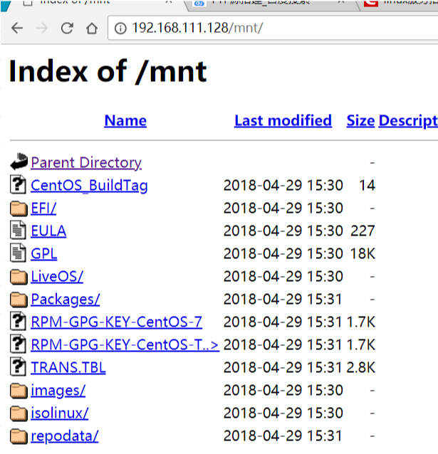

    Linux平台下搭建FTP服务器。

FTP 是File Transfer Protocol（文件传输协议）的英文简称，而中文简称为“文传协议”。用于Internet上的控制文件的双向传输。同时，它也是一个应用程序（Application）。基于不同的操作系统有不同的FTP应用程序，而所有这些应用程序都遵守同一种协议以传输文件。在FTP的使用当中，用户经常遇到两个概念：”下载”（Download）和”上传”（Upload）。

一般在各种linux的发行版中，默认带有的ftp软件是vsftp，从各个linux发行版对vsftp的认可可以看出，vsftp应该是一款不错的ftp软件。

### FTP源搭建

1. vsftp下载
如果没有FTP，需要进行yum下载vsftpd

    yum -y install vsftpd

2. vsftpd的配置
ftp的配置文件主要有三个，位于/etc/vsfpd目录下，分别是：
-   ftpusers 该文件用来指定哪些用户不能访问ftp服务器
-   user_list 该文件用来指定默认用户在默认的情况下也不能访问ftp
-   vsftpd.conf 该文件是vsftpd的主要配置文件，可以在这个文件里进行配置匿名的用户登陆ftp

3. 以匿名的方式登陆ftp
在任意文件下创建ftp文件：

    mkdir ftp

进入vsftpd.conf配置文件最后一行进行输入：

    anon_root=/root/ftp/

4. 关闭防火墙

    systemctl stop firewalld

5. 关闭SELinux

    setenforce 0

6. 启动服务

    systemctl start vsftpd

在我的电脑上输入:ftp://x.x.x.x可以进行匿名登陆

### FTTP源搭建
	yum -y install httpd #下载相应的httpd服务
	systemctl start httpd #启动httpd服务
	cp -rf /mnt/ /var/www/html/
	打开浏览器输入：http://x.x.x.x/mnt/

    
