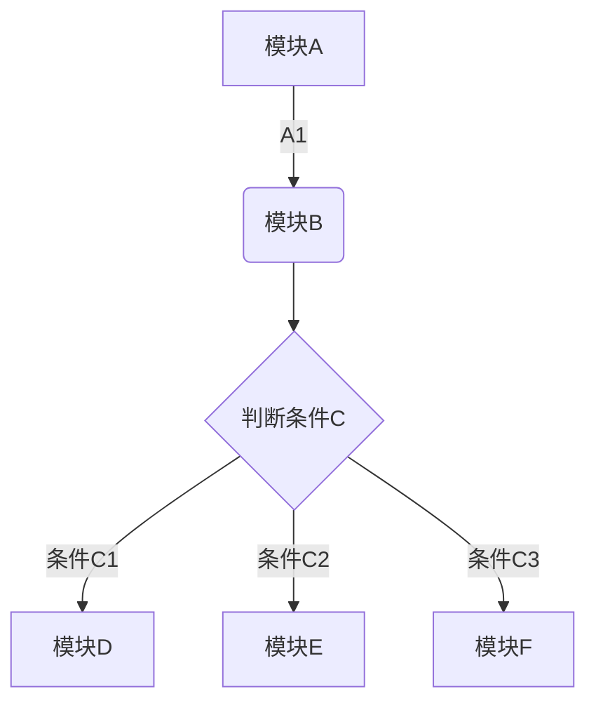
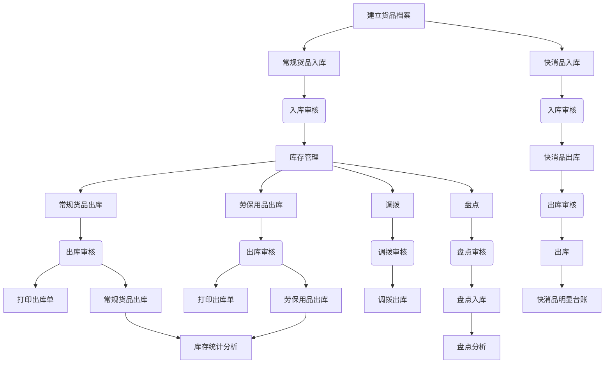
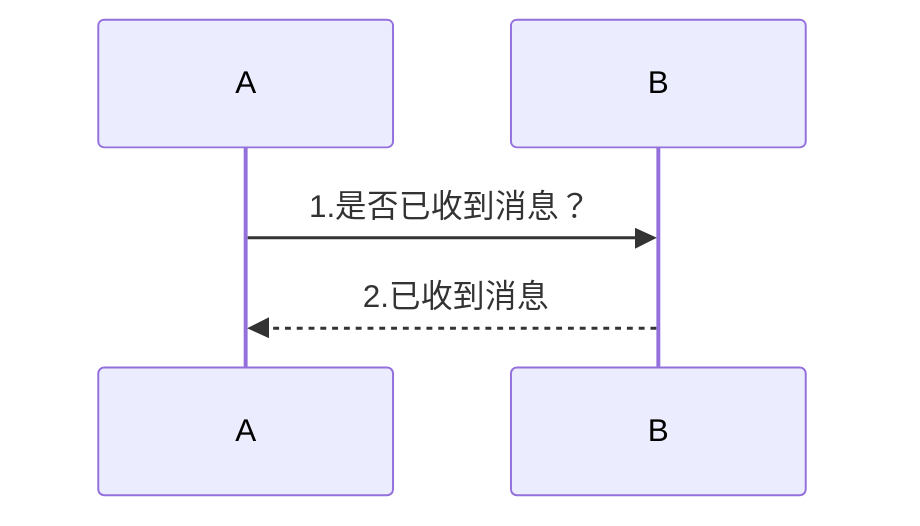
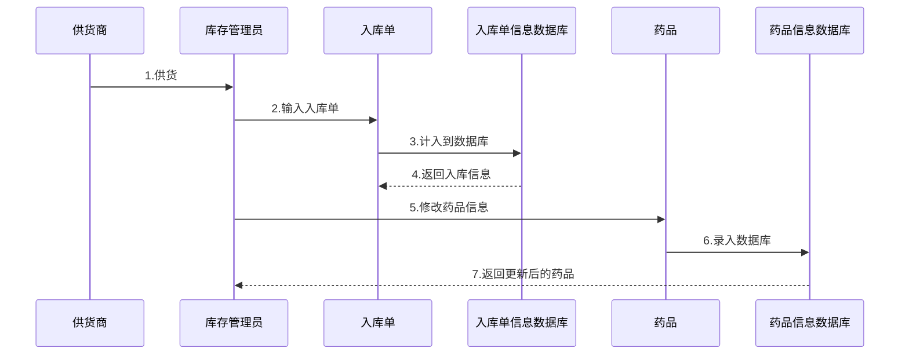
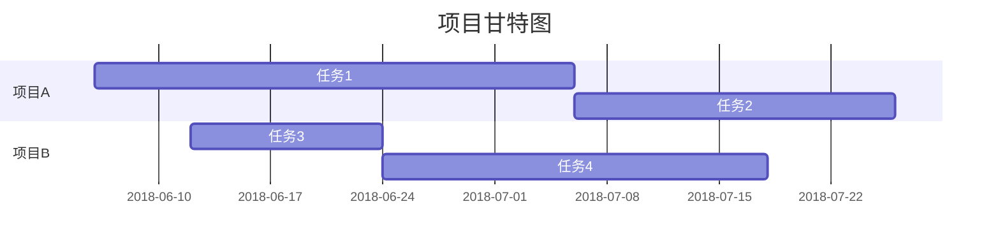
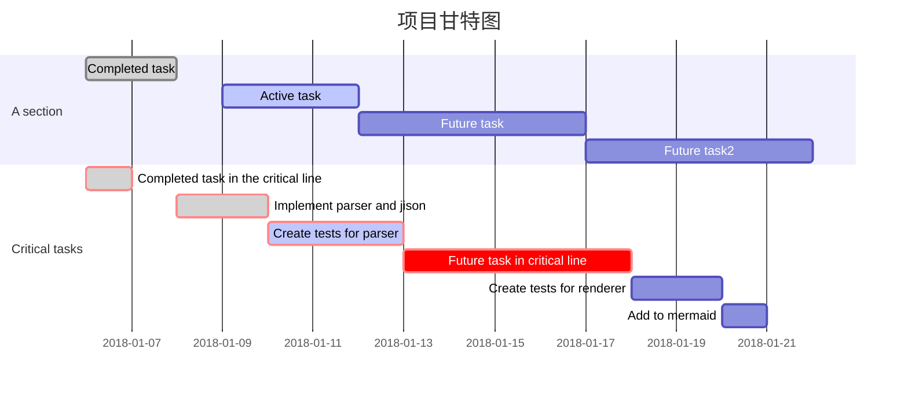

[TOC]

## 印象笔记新功能：Markdown

### Office

Office，相信大家应该都认识的，微软在九十年代早期就发布了的办公套件，到目前Office 系列在全球办公软件市场上也拥有着无可超越的统治级优势。它的优点就是强大的格式控制和排版功能、所见即所得的编辑模式、直观的界面、制表功能等等，但也正因为这些使得它是一个很重的工具。但虽然功能很强大自由，学习成本就高了，想要做出漂亮精美的排版，却要花上不少的心思和技巧，正所谓网上流行的一句话「编辑十分钟，排版半小时」。

### HTML
HTML，超文本标记语言，是一种用于创建网页的标准标记语言。加上 CSS 和 JavaScript 可以写出精美的网页和页面展示，但标签和语法太专业了，属于程序员的开发语言，对于一般人来说学习门槛较高。不过HTML 并不是程序员的专属语言，很多非程序员也在用HTML 辅助写很多东西。

### Markdown
Markdown，一种标记语言，一种用来写作的轻量级语言，没有 Office 琐碎的排版，也没有 HTML 专业的标签语法。只需要简单的标签和语法就可以做出漂亮的文章，真正的可以回归写作的初心：专心写作过程。只需要纯文本的内容和简单的格式，就能输出一份丰富格式的文档，这对于那些专注内容的写作者来说，简直是天大的福音。Markdown 在设计之初就把易读性放在与易写性同样重要的位置考虑了。

现在Markdown 在互联网业内已经很流行，可以称作「家喻户晓」，特别是网络写手、博客公众号作者、程序员，其实 Markdown 并不是程序员的专属，很多写作者都在用 Markdown 编辑文章，很多很多公众号的文章都是来自 Markdown 编辑处理的。不过的确Markdown 是一门很老的语言了，因为其良好的特性、简洁的格式、沉浸的体验，以及开源社区的支持和贡献，让Markdown 在互联网圈内火了。也和HTML 门槛较高，Office 的排版麻烦有一定的关系，大家希望有一个输入简单方便、输出漂亮的工具。

**Markdown 的优点**
* 格式简洁，编辑容易
* 专心写作，不用在意排版
* 门槛低，学习容易，上手简单
* 直观，可读性高
* 对代码支持很好

***

### 个人使用
我个人也是很早就在用Markdown 写文章和教程，中途停止过一段时间是因为电脑端和手机端同步编辑的问题，现在我只在电脑端编辑Markdown 了。一直以来，很多印象笔记的用户向我咨询「印象笔记什么时候支持Markdown？」，其实我个人也是很希望印象笔记支持Markdown的。虽然市面上很多Markdown 编辑器，也有很多不错的，比如马克飞象、小书匠、MWeb，但始终需求切换到另外的App 中进行编辑和处理，很不方便。

6月印象笔记重组，也就考虑加上了一些本地化的功能，这次的Markdown 就是首次发布的大功能，可以说非常的良心，也可以看出这次重组后印象笔记对国内用户的重视。

8.3日参加了印象笔记六周年生日活动，发布了几个本地化的功能，我挺欣喜的，6年了，终于可以做一些国内用户念叨已久的功能了，第一个就是 Markdown 功能。下面就介绍介绍印象笔记的 Markdown 功能：

***

### 印象笔记的 Markdown

#### 排版功能
对一篇文章排版，少不了多级标题，一级标题、二级标题到六级标题大象都支持的；还有加粗、倾斜、下划线、删除线这些基础的排版编辑功能都支持的，也支持文字颜色，可以选择各式各样的颜色。

很重要一点，支持 `TOC` 功能，`TOC` 是文章的目录，目录相当于整篇文章的导图，通过目录就能对整篇文章有一个大致的了解，也可以从目录大致判断这篇是否应该细读或粗略了解。

#### 分割线
如果一篇文章分为多个层次或是多个阶段或是多个段落，可以使用分割线把多个层级段落分隔开，巧妙的一条分割线也能增加文章的层次结构和思维逻辑。

`分割线`支持多种语法：

```
***
* * *
---
- - -
```

#### 引用块
当文章引用了别人的句子或段落可以使用 `引用` 功能，对一段文字的详细解释、或是对名词的解释或举例、或是对上文内容的补充或更正都可以使用 `引用` 功能。`引用` 能增强说服力，增添文采，也能让读者更好的理解上下文。用引用也是对原作者说的话的一种尊重和敬意。

`引用`的语法：
```
>引用的内容
```

#### 列表
列表有两种：无序列表和有序列表。无序列表也就是无序号的列表，也可以叫项目符号；有序列表就是有序号的列表。列表也可以叫做清单，这是我在大象里写笔记用的最多的功能。

列表清单的作用：
1. 能够让思路更清晰，前后逻辑关系更明了
2. 能让人更专注，利于事情的完成
3. 能够减轻焦虑，解放大脑

`无序列表`的语法：
* 9:00 会议室开会，讨论今天的工作内容
* 9:30 解决昨天遗留的问题
* 10:00 需求评审和开发工时确定
* 17:00 小组讨论解决今天遇到的问题

`有序列表`的语法：
1. 7:00 起床洗漱，煮早饭
2. 7:20 阅读新闻，以及处理私聊和群里大象用户的问题
3. 7:50 吃早饭，收拾上班

#### 任务
任务，也叫待办项，标记未完成或已完成的事项，方便做事务管理和 GTD 管理。配合列表使用，效果最好。

`任务`的语法：

* * [x] 任务1
* * [ ] 任务2
* * [ ] 任务3

1. * [ ] 任务1
2. * [ ] 任务2
3. * [x] 任务3

#### 缩进
缩进有增加缩进和减少缩进，通过合理地设置缩进格式，可以让文稿看起来更加美观，也能增加段落内容是层次结构。序号、待办项、缩进一起使用完美的体现出清单的作用：清晰的思路和一目了然的结构。

当你需要一段旅行时，出门前肯定得准备各种东西，生怕落下什么或忘记了什么。准备的东西多的时候，靠脑子几乎是不能记住的，这就必须借助纸笔或工具帮忙完成。

如果是写成一段文本内容，比如：购买旅游保险，购买机票，预定酒店，重要文件备份（扫描件／拍照），险单扫描件，驾照／身份证，酒店预订单，机票行程单，个人证件照电子版，手机安装旅行相关APP...
当看到这段内容和物品的时候，无法知道哪些已经准备了哪儿还没准备，而且整理完一样物品的时候，可能已经忘了前面整理了什么，又得去查看之前的物品，既浪费时间，也无头无序。

如果用清单，就一目了然了，哪些准备好了哪些还没准备，一看就明白了，减轻了大脑的负担，整个人也轻松很多。

* 出行前准备
    * * [ ]购买旅游保险
    * * [ ]购买机票
    * * [ ]预定酒店
    * * [ ]重要文件备份（扫描件／拍照）
        * * [ ]保险单扫描件
        * * [ ]驾照／身份证
        * * [ ]酒店预订单
        * * [ ]机票行程单
        * * [ ]个人证件照电子版
    * * [ ]手机安装旅行相关APP
* 出行前一天
    * - [ ]设置工作电子邮件自动回复
    * - [ ]结算必要的帐单（充电卡／水卡／煤气卡，防止回到家傻眼儿）
    * - [ ]托管自己的宠物、植物
    * - [ ]告诉家人或者熟悉的朋友自己的行程
    * - [ ]装好个人常用药（创可贴）
    * - [ ]准备好现金和信用卡／银行卡
    * - [ ]准备随身携带文件
    * ...

从上面的也可以看出 `任务` 有两种语法:
```
- [ ]任务
* [ ]任务
```

#### 链接
文章需要链接外部链接的内容或做导航时，就可以使用 `链接` 功能。文章内容太多，

1. 文中的内容需要更多的详细介绍和说明，可以用 `链接` 功能跳转到更详细的页面
2. 文中引用了别人的部分内容或参考文献，可以用 `链接` 功能跳转到别人的原文或参考文献的页面
3. 做导航：一篇写不完就可以分为多篇文章编写，当读者找到了某一篇文章后，想要找这一系列其他的文章，就可以通过直接点击链接的方式进行跳转，比如教程、功能介绍。在提高了用户体验度的同时又提高了用户停留时间，

`链接`功能的语法：
* [印象笔记官网](https://www.yinxiang.com/)
* 印象大使：<https://www.yinxiang.com/community>
* <a href="https://help.yinxiang.com/hc/zh-cn">印象笔记官方知识库</a>

#### 图片
一篇文章，肯定少不了图片的。文章中加入一些图片，文章更有说服力，也能增强读者的阅读体验，图片比文字让人更容易理解，特别是使用方法、功能介绍、教程类的文章，再动人的文章不如一张有说服力的图片，图片的底部再加上一点说明的小字效果更好。新闻学研究已经证明，图片和图片底部的说明文字的阅读率远大于内容许多倍。图片，可以说是文章的画龙点睛之笔。

`图片`的语法：


#### 表格
表格作为一种常见的信息组织整理手段，在办公领域有着举足轻重的地位，特别是财务会计，无表格不工作的程度。

表格是用来收集、整理、组织、分析数据的二维矩阵，由行、列分割而成的单元格是构成表格的基本元素，表格的行、列之间相互独立又相互关联。

表格的设计集中体现在可读性和易操作两个方面，如果处理得当，复杂的数据也能让用户轻松浏览和比较，清晰易懂。

//TODO

`表格`的语法：

| 序号 | 笔记 | 内容 | 时间 |
| --- | --- | --- | --- |
| 1 | note1 | contents1 | 2018-08-20 09:14:34 |
| 2 | note2 | contents2 | 2018-08-20 09:14:38 |
| 4 | note3 | contents3 | 2018-08-20 09:14:41 |

<table>
    <tr>
        <th>序号</th>
        <th>笔记</th>
        <th>内容</th>
        <th>时间</th>
    </tr>
    <tr>
        <th>1</th>
        <th>note1</th>
        <th>contents1</th>
        <th>2018-08-20 09:14:34</th>
    </tr>
    <tr>
        <th>2</th>
        <th>note2</th>
        <th>contents2</th>
        <th>2018-08-20 09:14:38</th>
    </tr>
    <tr>
        <th>3</th>
        <th>note3</th>
        <th>contents3</th>
        <th>2018-08-20 09:14:41</th>
    </tr>
</table>

**印象笔记三种账户类型的功能介绍**
| 序号 | 免费帐户(免费)| 标准帐户(¥8.17/月(按年支付)) | 高级帐户(¥12.33/月(按年支付)) |
| --- | --- | --- | --- |
| 1 | 月上传流量 60 MB | 月上传流量 1 GB | 月上传流量 10 GB |
| 2 | 同步 2 台设备 | 同步所有设备 | 同步所有设备 |
| 3 | 多平台管理资料 | 多平台管理资料 | 多平台管理资料 |
| 4 | 剪藏网页和图片 | 剪藏网页和图片 | 剪藏网页和图片 |
| 5 | 搜索图像内的文字 | 搜索图像内的文字 | 搜索图像内的文字 |
| 6 | 高效共享协作 | 高效共享协作 | 高效共享协作 |
| 7 | 手机密码锁定 | 手机密码锁定 | 手机密码锁定 |
| 8 |  | 离线访问笔记 | 离线访问笔记 |
| 9 |  | 转存邮件到印象笔记 | 转存邮件到印象笔记 |
| 10 |  | 优先客服支持 | 优先客服支持 |
| 11 |  |  | 官方微信客服 |
| 12 |  |  | PDF深度搜索 |
| 13 |  |  | Office文档搜索 |
| 14 |  |  | 标注PDF文档 |
| 15 |  |  | 智能名片扫描 |
| 16 |  |  | 一键演示笔记 |
| 17 |  |  | 查看笔记历史 |
| 18 |  |  | 查看相关笔记及内容 |

>第一个和第三个表格是用 Markdown 语法写的，第二个表格是 HTML 语法写的，一眼就能看出 Markdown 的语法比 HTML 语法简洁简单很多，而且一眼就能看懂，而 HTML 的语法则需要懂的 HTML 知识的人才明白是什么，对于不懂 HTML 的人来说，这就是一堆「乱码」，完全看不出是个表格。

#### 图表
面对生硬冰冷的数据，往往让人心生畏惧，而且也很难一眼看出其中的关系和差别。表格只是展示数据，无法直观的表示出数据之间的关系和比例。图表可以通过长度、角度、方向、形状、面积、体积、颜色来产生视觉暗示，达到聚焦用户视线，表达图表所表达含义，用图形图表，能直观的展示出数据的关系和差别；不同的图表展示的数据情况和重点不同，选择一个合适的图形图表，也能更精准的表达数据的信息。一个好的图表应该观点明确、简洁漂亮。

* 饼图
饼状图主要用于各个数据的组成部分，各个部分占整体的比重，并且各个部分百分比之和等于100%，可以反映出数据构成的比例关系。比如公司的男女比例、部门成员的东南西北地区分布、个人/家庭收入比例、个人/家庭支出比例、8月份用户的等等适用于表达“份额”“比例”“百分比”这类情况，但饼状图的部分数量不宜过多。

```chart
,Budget,Income,Expenses,Debt
June,5000,8000,4000,6000
July,3000,1000,4000,3000
Aug,5000,7000,6000,3000
Sep,7000,2000,3000,1000
Oct,6000,5000,4000,2000
Nov,4000,3000,5000,

type: pie
title: Monthly Revenue
x.title: Amount
y.title: Month
y.suffix: $
```

* 折线图
线形图主要用于展示一段时间或周期内数据的变化情况，方便预测未来的发展趋势。比如每周/每月的气温变化、近期股票的行情变化、人民币/美元的价格变化走势。
```chart
,Budget,Income,Expenses,Debt
June,5000,8000,4000,6000
July,3000,1000,4000,3000
Aug,5000,7000,6000,3000
Sep,7000,2000,3000,1000
Oct,6000,5000,4000,2000
Nov,4000,3000,5000,

type: line
title: Monthly Revenue
x.title: Amount
y.title: Month
y.suffix: $
```

* 柱状图
柱形图利用柱子的高度，能够比较清晰的反映数据的差异，通常用于不同时期或不同类别数据之间的比较，也可以用来反映不同时期和不同数据的差异。柱形图的局限在于它仅适用于中小规模的数据集，当数据较多时就不易分辨。可以非常清晰的表达不同项目之间的差距和数值，也可以简单的体现出。比如成都今年或这月的降雨量、公众号每天的关注人数、一周/一月公众号文章的阅读量等等
```chart
,Budget,Income,Expenses,Debt
June,5000,8000,4000,6000
July,3000,1000,4000,3000
Aug,5000,7000,6000,3000
Sep,7000,2000,3000,1000
Oct,6000,5000,4000,2000
Nov,4000,3000,5000,

type: column
title: Monthly Revenue
x.title: Amount
y.title: Month
y.suffix: $
```

* 条形图
显示各个项目之间的比较情况，和柱状图类似的作用，不同图表的方向是横向展示，这样也能比柱状图展示更多的内容。比如：全国各地区人均GDP、全国各地区人口数量等等
```chart
,Budget,Income,Expenses,Debt
June,5000,8000,4000,6000
July,3000,1000,4000,3000
Aug,5000,7000,6000,3000
Sep,7000,2000,3000,1000
Oct,6000,5000,4000,2000
Nov,4000,3000,5000,

type: bar
title: Monthly Revenue
x.title: Amount
y.title: Month
y.suffix: $
```

### 内嵌代码
`this is code`

### 插入代码块
Markdown 对代码的支持很好，这也是使得 Markdown 在 IT 领域很流行的一个主要原因。这非常方便于程序员在笔记中存放有用或有趣的代码，最主要是支持代码高亮显示关键字。
```Java
public static void before() {
    try {
        Class.forName("org.sqlite.JDBC");
        c = DriverManager.getConnection("jdbc:sqlite:" + path);
        System.out.println("Opened database successfully");
        stmt = c.createStatement();
    } catch (Exception e) {
        e.printStackTrace();
    }
}
```
```ObjectiveC
#import <Foundation/Foundation.h>

int main(int argc, char *argv[]) {

    @autoreleasepool {
        NSLog(@"Hello World!");
    }

   return 0;
}
```
```Swift
var teamScore = 0
for score in individualScores {
    if score > 50 {
        teamScores += 3
    } else {
        teamScores += 1
    }
}
teamScore
```
``` Python
@requires_authorization
def somefunc(param1='', param2=0):
    '''A docstring'''
    if param1 > param2: # interesting
        print 'Greater'
    return (param2 - param1 + 1) or None
class SomeClass:
    pass
>>> message = '''interpreter
... prompt'''
```

#### 添加数学公式
正在读书或考研的人来说，数学公式肯定是少不了的，大象的 Markdown 支持 KaTeX 和 LaTeX 数学公式。

```math
e^{i\pi} + 1 = 0
```

$\Gamma(n) = (n-1)!\quad\forall n\in\mathbb N$

$x = \dfrac{-b \pm \sqrt{b^2 - 4ac}}{2a}$

#### 添加流程图

流程图（Flow Chart）：使用图形表示算法的思路是一种极好的方法，因为千言万语不如一张图。用一些尽可能少的规定的符号及连线来表示某个具体业务处理过程，流程图易于阅读和理解，是分析业务流程的重要步骤。可以帮助了解某项业务的具体处理过程，发现和处理系统调查工作中的错误和瑕疵，修改和删除原系统不合理的部分，在新系统的基础上优化处理流程。



#### 添加时序图

时序图（Sequence Diagram），又名序列图、循序图，是一种UML交互图。它通过描述对象之间发送消息的时间顺序显示多个对象之间的动态协作。它可以表示用例的行为顺序，当执行一个用例行为时，其中的每条消息对应一个类操作或状态机中引起转换的触发事件。



#### 添加甘特图
在做项目管理中，甘特图是一个非常重要的项目管理工具，甘特图（Gantt chart）又称为横道图、条状图(Bar chart)。其通过条状图来显示项目，进度，和其他时间相关的系统进展的内在关系随着时间进展的情况。通过图形的方式更直观的表现出任务安排以及任务之间的关联性，有了甘特图，可以使项目经理从大量的密密麻麻的表格中解脱出来。



#### 切换主题

* 白色
* 黑色
* 深空色
* 印象绿(大象定制)

#### 编辑模式

可以切换编辑+预览双屏模式和纯编辑模式
    
#### 支持HTML


* * *

### 结语
看到这里，相信大家对于 Markdown 和印象笔记中 Markdown 的功能已有初步的认识和了解。

的确，Markdown 在很多方便都有很多的应用，而且对于工作和生活中写文章都很方便。虽然Markdown 有诸多的优点，也有其独特的魅力所在，但也有缺点，兼容性问题、图片和表格支持问题、中英文切换等等问题；还有不同编辑器对 Markdown 格式的支持有区别，从一个编辑器复制的格式到另外一个编辑器有可能存在不兼容的问题 。Markdown 并不是万能的，也不适合用来写Word 里的正式文档。

但这些问题也不妨碍大家不断的寻求更好用的Markdown 工具，目前市面上有众多的 Markdown 编辑器。

其实写文章注重的应该是内容，而非格式，不要过于在意格式而忘了内容的重要些。

在互联网上混迹这么久，我发现一个现象：Markdown 知道的人很多，去学的人不多，学会了的人更不多，学会了之后坚持还在继续用的人更不多，用 Markdown 写出发表自己内容的更少了。Markdown 其实已算不上一个装逼的技能了，已经太流行了，但还在继续坚持的写作的人才是最可贵的，这种精神和毅力，这些坚持值得我们大家都去学学，谢谢你们！

中国版的印象笔记，不仅有Markdown，还有：桌面端锁定密码、分享到QQ 空间/微信等等，以后也还会有更多的功能发布。拭目以待吧！期盼印象笔记越来越接地气！

谢谢！

## 聪聪
&copy;聪聪：印象笔记资深印象大使 | 印象笔记年度象亲 | 坚果云效率大使 | 幕布布道师 <https://t.me/congcong>

印象笔记用户群 Telegram 群：<https://t.me/yinxiangbiji>

