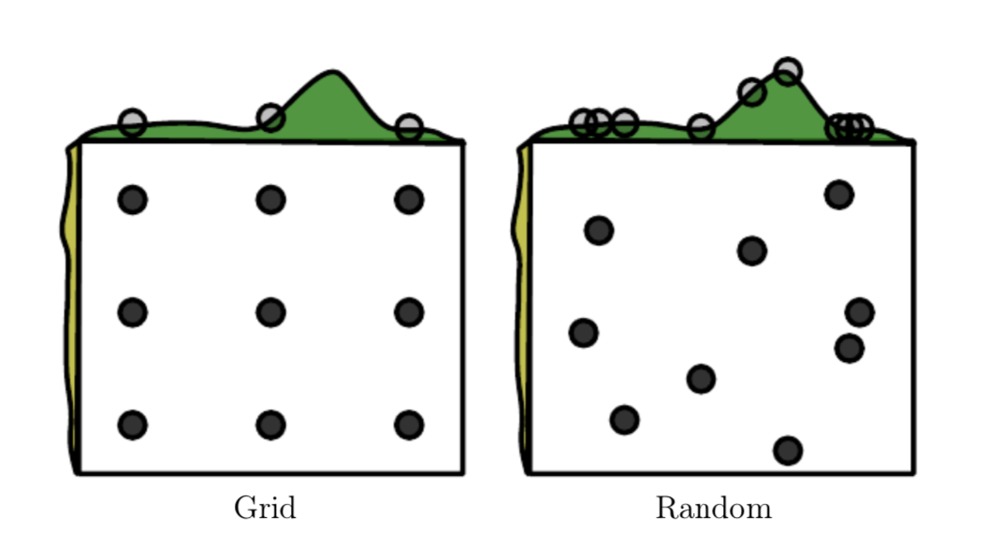

# 从Goodfellow, Bengio和Courville的Deep Learning课本开始

三位大佬在书中提到了三种自动调参的思路 (喜欢手动调参的请跳过):

1. Grid Search
2. Random Search
3. Model-Based Hyperparameter Optimization

## Grid Search
**Grid Search** 其实就是一个暴力解法。列出所有你想测试的超参数，然后找出所有可能的组合，最后从 validation loss 里面找出最好的一组超参数。这是一个非常消耗资源的方法。如果有 m 个超参数，每个超参数选最多 n 个可能值，那么该算法的时间复杂度是 ${O(n^m)}$. 

书中还指出，要想通过 Grid Search 找到比较优的超参组，一次 Grid Search 是不够的。只能通过反复使用 Grid Search，在每次遍历缩小上一次 Grid Search 的范围以此达到较优结果。Grid Search 很容易做到平行计算，因为不同超参数组之间几乎没有干扰。然而因为指数时间复杂度，及时使用平行计算依然无法满足某些模型的调参需求。

在我看来 Grid Search 是无法满足自动调参的需求的。它只能作为手动调参的辅助工具，在人的经验之上选择可靠的区间和备选数值，并且认为的在过程中调整区间从而找到较优参数组。如果相信超参数之间是独立的话，那这个 Grid Search 的时间复杂度是可以从 ${O(n^m)}$ 下降到 ${O(nm)}$ 的。唯一需要注意的是，超参之间的独立性并不是绝对成立的，目前我没找到理论证明这一点。(*"Usually most of these hyperparameters are independent from each other"* - Bengio-2016)

## Random Search

## Grid Search VS. Random Search

