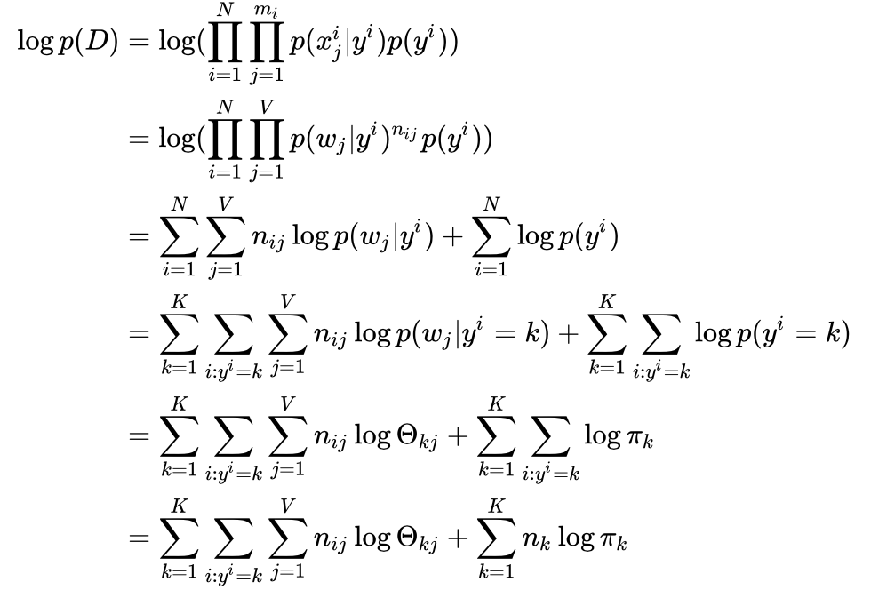
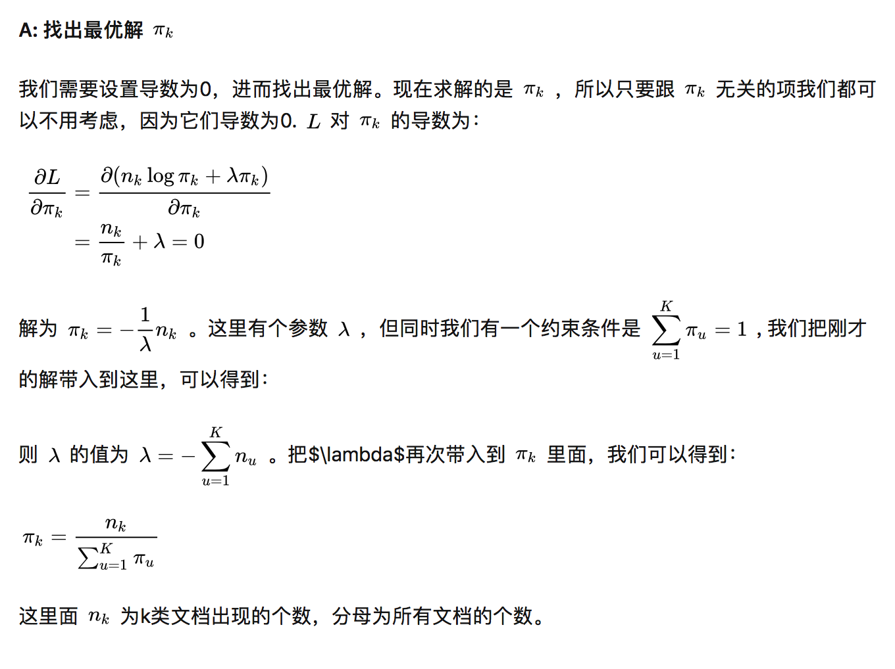
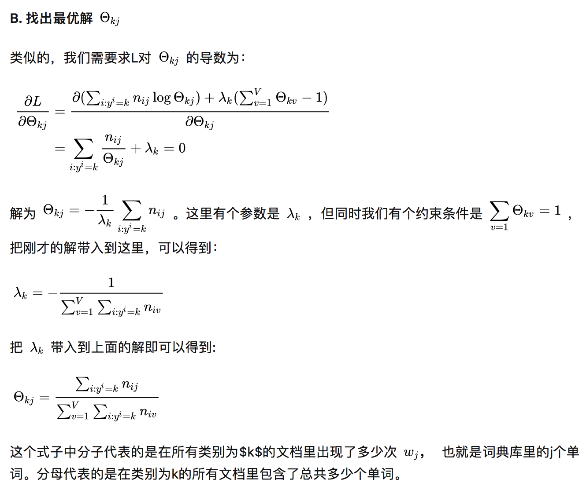

## Spark朴素贝叶斯(Naive Bayes)分类理论和源码分析
https://nlp.stanford.edu/IR-book/html/htmledition/naive-bayes-text-classification-1.html

https://nlp.stanford.edu/IR-book/html/htmledition/properties-of-naive-bayes-1.html

https://nlp.stanford.edu/IR-book/html/htmledition/the-bernoulli-model-1.html

拉格朗日求解模型参数
https://zhuanlan.zhihu.com/p/71960086

 

 

 

 

平滑：
伯努利：分子+1，分母+2。每个词只有{0,1}两个状态，因此是2
多项式：分子+1， 分母每个词都要+1

## LDA: 
1. https://www.cnblogs.com/breezedeus/archive/2013/01/20/2868930.html
2. LDA数学八卦
3. spark源码 https://endymecy.gitbooks.io/spark-ml-source-analysis/content/聚类/LDA/docs/docs/docs/docs/docs/docs/On%20Smoothing%20and%20Inference%20for%20Topic%20Models.pdf

## 分布式增量计算均值、方差 Spark：
1. https://blog.csdn.net/snaillup/article/details/75208638
2. https://endymecy.gitbooks.io/spark-ml-source-analysis/content/%E5%9F%BA%E6%9C%AC%E7%BB%9F%E8%AE%A1/summary-statistics.html

## 谱聚类：
1. https://www.cnblogs.com/pinard/p/6221564.html

## 条件高斯分布 + 贝叶斯定理
1. 滴滴“猜您去哪”的算法实现
http://www.semocean.com/lbs%e7%8c%9c%e4%bd%a0%e5%8e%bb%e5%93%aa%e5%84%bf%e5%8a%9f%e8%83%bd%e5%ae%9e%e7%8e%b0/
http://www.sohu.com/a/158543230_355140
