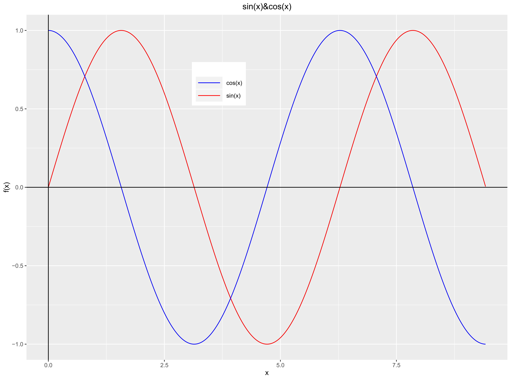
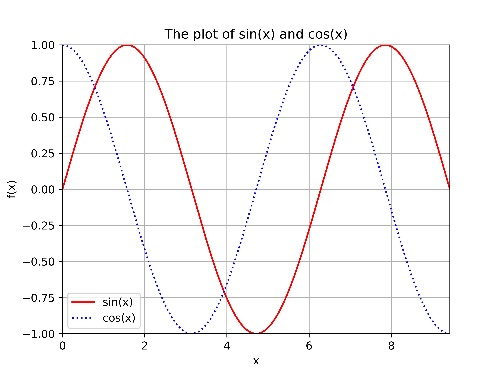
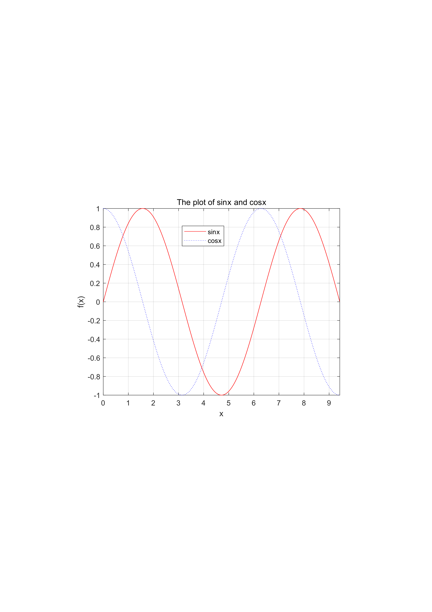

> 本片文章旨在比较笔者几种常用的绘图软件**Excel**,**R**，**Python**，**Matlab**与**Tikz绘图宏包**的绘图效果，并探讨它们的优缺点，供各位读者以学习交流。
>
>下面我们以绘制函数$~f(x)=\sin(x)~$与$~f(x)=\cos(x)$在区间$[0,3\pi]$的函数区间为例，来比较这几种绘图的区别以及其优劣性。

# 1. Excel

**Excel** 的定位是一个<u>办公软件</u>，主要用于表格的填写，当然， 它也内置了函数绘图功能。在绘图时，我们需要将数据输入表格，然后选中行列用图表中的内置折线图来绘制。
以$2^\mathrm{o}$为步长，先生成$271$组数据，然后绘制的余弦与正弦函数曲线，效果如下图：


**优点:**

- 操作简单，容易上手，纯鼠标操作。
- 对例如每月的营业额趋势，这类的绘图较为便利

**缺点:**

- 只能绘制简单的曲线
- 数据体积过大，Excel处理起来较为复杂，例如以$0.1^{\mathrm o}$为步长，需要生成上千组数据，繁琐
- 生成图的横纵坐标，标题等标签不易调整


# 2. R

**R**是用于统计分析、绘图的语言和操作环境。R是属于GNU系统的一个自由、免费、源代码开放的软件，它是一个用于统计计算和统计制图的优秀工具。其定位是<u>统计分析</u>。使用它不需要具有编程方面的思想，只要搞清楚基本的统计学原理就OK。

R的绘图功能只要是依靠具有绘图功的第三方包如$ggplot2$


绘图代码如下
```Rmd
#导入包
library(ggplot2)

# 创建数据点
x <- seq(0,3*pi, by=0.01)#数组步长为0.01
sine<-sin(x)
cosine<-cos(x)
df <- data.frame(x,sine,cosine)

# 用ggplot2来画图
g <- ggplot()
g<-g+geom_line(data = df,aes(x=x,y=sine,colour="sin(x)"),)+
    geom_line(data = df,aes(x,cosine,colour="cos(x)")) +
        scale_colour_manual("",values = c("sin(x)" = "red","cos(x)" = "blue"))+
            xlab("x")+ylab("f(x)")
g <- g + geom_hline(yintercept = 0)+geom_vline(xintercept = 0) #坐标轴

#设置居中标题与图例参数
g <- g + labs(title="sin(x)&cos(x)")+ 
  theme(plot.title = element_text(hjust = 0.5),legend.position=c(0.4,0.80),
        legend.key.size=unit(0.7,'cm'),legend.key.width=unit(1.5,'cm'))

g
```

效果为：




**优点：**

- 开源，免费
- 图形精致
- 可绘制的图形种类多，例如：散点图、箱线图、小提琴图、直方图以及密度曲线图等
- 统计绘图效果好，处理上千上万数据不在话下
- 不需具有编程思想或能力~~当然有更好~~

**缺点**

- 主要是统计绘图
- 绘制对应的图需要知晓对应的绘图函数，加载对应的绘图包（需要经常查帮助文件）


# 3. Python

Python是一种跨平台的计算机程序设计语言。是一种<u>面向对象的动态类型语言</u>。它有着丰富的，大多数完全免费的扩展库。

在绘图时，我们主要用到$Numpy$与$Matplotlib$这两个扩展库。后面一个的函数与$Matlab$有很多共同之处。

**Python**

绘图代码为
```python
#导入对应的模块
import numpy as np
import matplotlib.pyplot as plt
import math


x=np.arange( 0, 3*math.pi, 0.01 )
sine=np.sin(x)
cosine=np.cos(x)

#开始画图
plt.title('The plot of sin(x) and cos(x)')
plt.plot(x,sine,color='red',label='sin(x)',linestyle='-')
plt.plot(x,cosine,color='blue',label='cos(x)',linestyle=':')
plt.legend() # 显示图例

#设置盒子范围
plt.axis([0, 3*math.pi, -1, 1])
plt.grid(True)

#设置标签
plt.xlabel("x")
plt.ylabel("f(x)")
plt.show()
```

效果图为


**优点**：

- $Numpy$和$Matplotlib$包开源，免费
- Python学习曲线平缓
- 绘图质量高，能导出为多种图片格式
- 软件小巧灵便

**缺点**

- 需要一定的编程思想


# 4. Matlab

MATLAB是一种用于算法开发、数据可视化、数据分析以及数值计算的高级技术计算语言和交互式环境。它是以<u>矩阵运算</u>为基础的。在设计大量矩阵运算的项目，可以考虑使用它。一般在数学建模，本科学习中经常会用到它。是数学界三大软件之一。

代码：
```matlab
x=0:0.01:3*pi;
% 以0.01为步长，创建数组

sine=sin(x);
cosine=cos(x);

plot(x,sine,'-r');
hold on
% 固定图窗
plot(x,cosine,':b');

axis([0 3*pi -1 1]);
grid on%加网格

% 设置标签
xlabel('x')
ylabel('f(x)')
title('The plot of sin{x} and cos{x}')
legend({'sin{x}','cos{x}'})
shg
```
显示效果



**优点**：

- 绘图命令简单
- 绘图种类多样
- 可以绘制三维图
- 支持向量并行运算
- 数据标签支持部分的Tex语法
- 支持部分的鼠标操作


**缺点**

- 商业软件，需要付费
- 画的图虽然高端一点，但是带有”锯齿“的风格
- 软件大，打开慢


# 5. Tikz

TikZ 是 LaTeX 下的一个（著名的）绘图宏包。使用它必须安装Latex环境。绝大多数能够精确描述的矢量图，理论上都可以用 TikZ 画出来。最近笔者刚刚学习这个，刚一入手，就立马那种简单清晰的绘图效果所惊异，满足了我的强迫症和完美主义。当然，我还是不推荐初学者去用这个画图的 ~~虽然我也是初学者~~

我知道，一定有很多很优秀以及有强迫症之类的同学~~说白了就是无聊，和我有的一拼~~，可以学学。

补充一点，这方面的资料在网上比较琐碎，需要耐心找。英语足够好的话，可以网上搜索官方文档*TikZ&PGF*，英文文档，总计1302页！！！！~~看完，你也就超脱了。~~

附:微信公众号的封面就是用Tikz包绘制的分形图形，可看一下效果。

下面给出绘制函数代码（下图为Texlive2019环境，编译方式XeTex）

```tex
\documentclass{standalone}

\usepackage{ctex}
\usepackage{tikz}%导入Tikz宏包
\tikzset{elegant/.style={smooth,thick,samples=50,cyan}}
\usetikzlibrary{calc}
%设置曲线圆滑

\begin{document}
	\begin{tikzpicture}
		\draw[very thin,lightgray] (0,3.6) grid (10,-3.6);
		\draw[->] (0,-3.6)--(0,3.6) node[left,below left] {$f(x)$};
		\draw[->] (0,0) node[below=2pt,below left] (O) {$O$} -- (10.5,0) node [below right] (){$x$};
		\fill (0,0) circle(2pt);
		 \draw[elegant,red,domain=0:3*pi] plot(\x,{2*sin(\x r)});
		 \draw[elegant,blue,domain=0:3*pi] plot(\x,{2*cos(\x r)});
		
		%绘制节点
		\node[below] () at (pi/2,0){$\frac{\pi}{2}$};
		\node[below] () at (pi,0){$\pi$};
		\node[below] () at (3*pi/2,0){$\frac{3\pi}{2}$};
		\node[below] () at (2*pi,0){$2\pi$};
		\node[below] () at (5*pi/2,0){$\frac{5\pi}{2}$};
		\node[below] () at (3*pi,0){$3\pi$};
	 	\foreach \x in {0,1,4,5}
	 	{
	 		\draw[dashed,gray] (pi/2*\x,0)-- +(0,2);
	 	}
 	\foreach \x in {2,3,6}
 	{
 		\draw[dashed,gray] (pi/2*\x,0)-- +(0,-2);
 	}
 
 %绘制图例与标题
  \node(ce) at (3,3){};
  \draw[red] ($(ce)+(0,-0.1)$) -- +(0.7,0) node[right=3pt]() {$\sin{x}$};
	\draw[blue] ($(ce)+(0,-0.6)$) -- ($(ce)+(0.7,-0.6)$) node[right=3pt]() {$\cos{x}$};
	\node[right] at ($(ce)+(0,1)$) {$The~plot~of~\sin{x}~and ~\cos{x}$};
	\end{tikzpicture} 
\end{document}

```

生成的图片效果为


**优点**

- 绘制效果好，排版起来特别精致
- 若用tex排版论文，直接可将绘图代码输入，保证了标签字体，大小等与正文一直
- 适合正规学术绘图，教学讲义
- 满足对排版有极致需求的作者
- 基础语法固定

**缺点**

- 学习曲线极其极其陡峭
- 需要安装latex环境
- 网上参考资料少
- 官方英文文档1000多页
- 绘制一个简单的图像也需要很长的时间，极其考验耐心

# 6. 作者有话要说

- 其实，我写本文的重点放在了Tikz绘图上面，对它的叙述稍微多一点。其实笔者经常用到的绘图软件就是**Matlab**，直到最近，才迷上了~~Tikz~~。

- 然而，自己花长时间学~~Tikz~~是不大现实的，毕竟自己不可能一直很优秀（~~其实是不可能一直这么闲~~）。

- Matlab预计是以后的时间里经常被我用到的，毕竟代码量真的很少啊，高效果

- 绘图，要考虑实际，要权衡各个软件，比较哪种效果更有优越性（图形质量,绘图时间）。各种软件各有偏颇，最终的选择权还是在自己。
- 所以，各个绘图软件学一点，总没坏处。


>**参考链接**
>1.  [将pdf文件转换为png等图像格式的方法](https://wenda.latexstudio.net/article-5056.html)
>2. [LaTeX中绘制分形图形](http://wangmurong.org.cn/2015/05/03/2015-05-03-draw-fractal-latex/)
>3.  [Tikz函数绘图](https://www.latexstudio.net/archives/2234.html)
