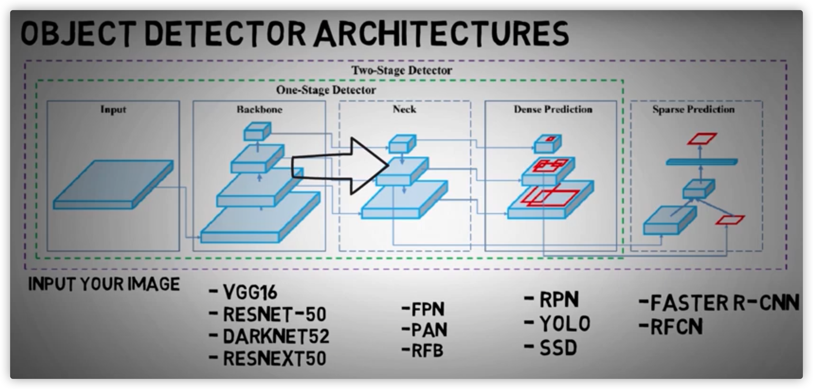
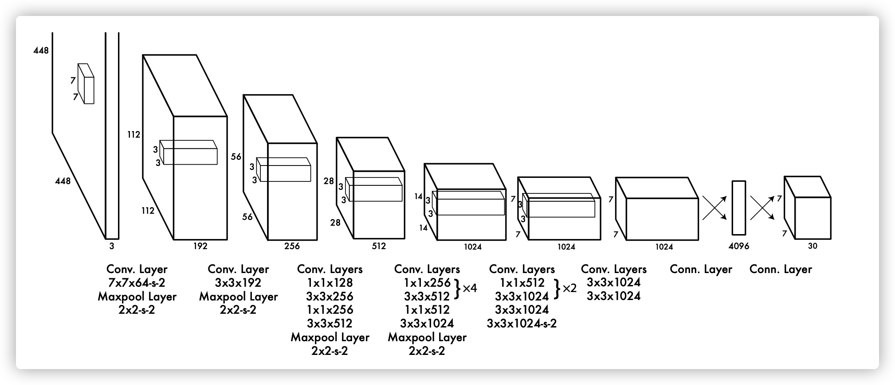
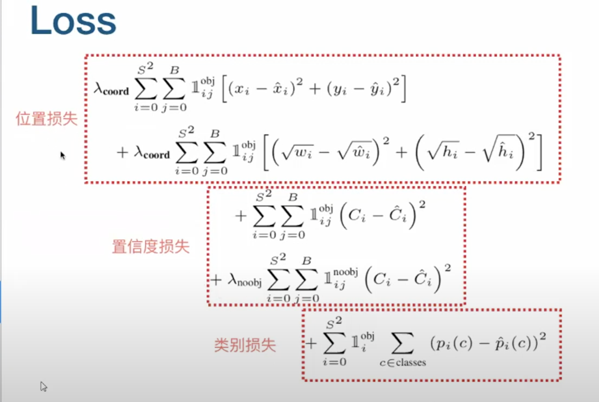
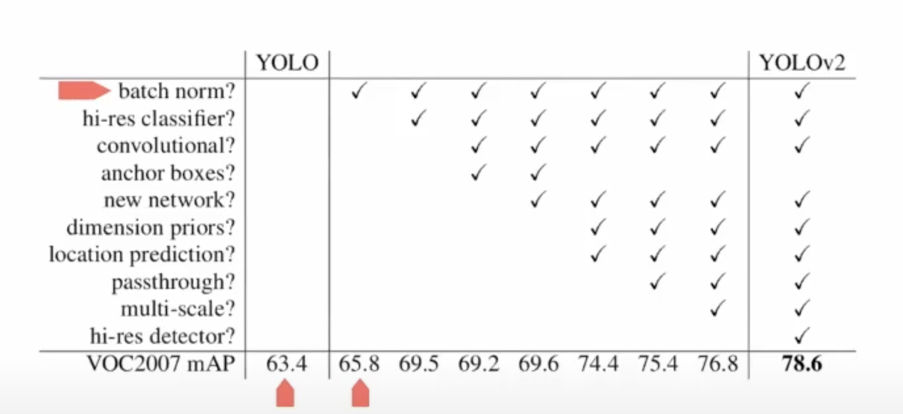
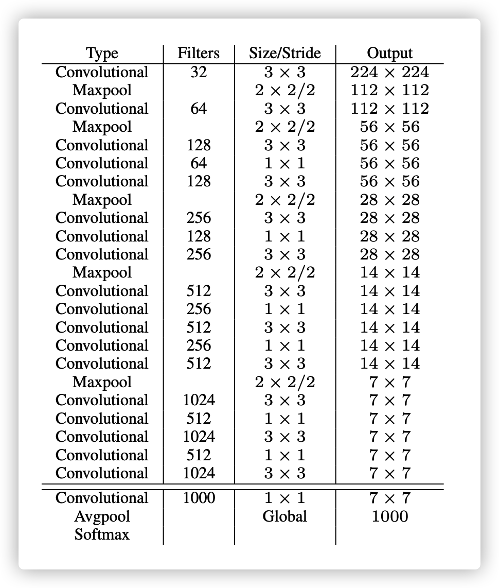
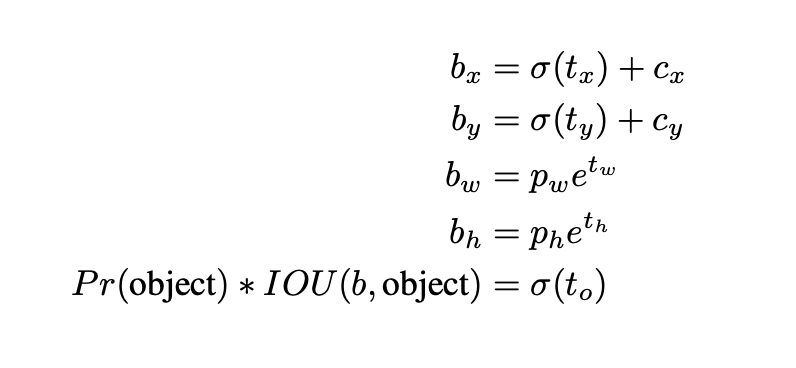
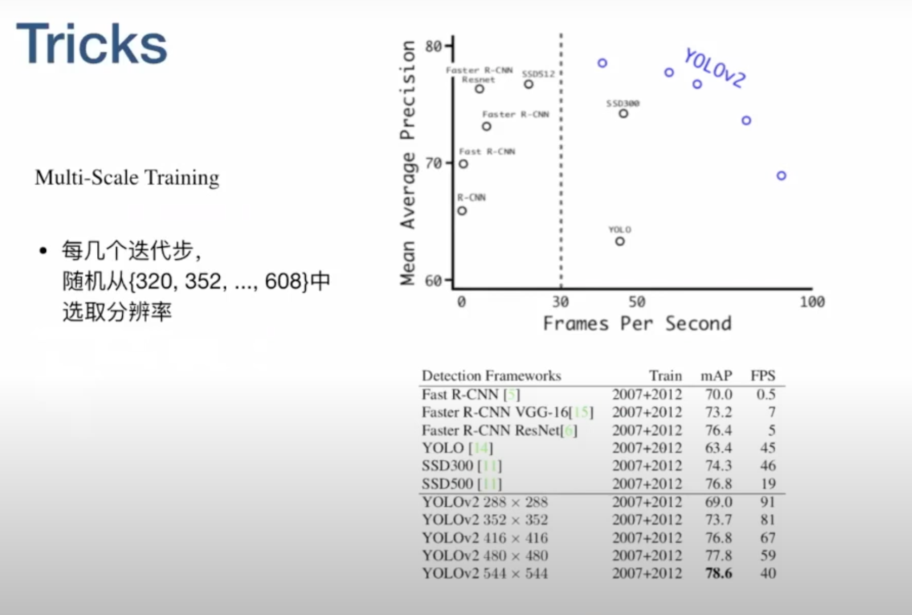

# YOLO

## The History


目前用的比较多的是YOLOv3，v3出来之后，v1和v2的代码便不再公开


## 目标检测总体框架图




## Yolov1:

## You Only Look Once: Unified, Real-Time Object Detection

Convert **object detection** into **regression**


The system models detection as a regression problem. It divides the image into an `S × S` grid and for each grid cell predicts B bounding boxes, confidence for those boxes, and C class probabilities. These predictions are encoded as an `S × S × (B ∗ 5 + C) `tensor

如上图所示，输入图片被划分为7x7个单元格，每个单元格独立作检测。
在这里很容易被误导：每个网格单元的视野有限而且很可能只有局部特征，这样就很难理解yolo为何能检测比grid_cell大很多的物体。其实，yolo的做法并不是把每个单独的网格作为输入feed到模型，在inference的过程中，网格只是物体中心点位置的划分之用，并不是对图片进行切片，不会让网格脱离整体的关系。
可以通过yolo_v1的structure来进一步理解，相比faster r-cnn那种two-stage复杂的网络结构而言，yolo_v1的网络结构显得亲民得多。基本思想是这样：预测框的位置、大小和物体分类都通过CNN暴力predict出来。


关于bounding box和class的实现的理解：

目前我的理解是这样的：

* 在CNN中，可以获得每个格子中的物体类别，对应于Class probability map

* 同时在CNN中，可以获得位置特征，物体的中心落在某个grid，那么这个grid就负责预测这个物体的bounding box。而其他grid获得的box信息和class信息都not care。是否落在这个grid应该就是由confidence的，即置信度，越接近1，则表示物体中心落在这个grid的概率越大，bounding box越准确。

* 所以，最后有个别几个grid能输出object  bounding box和class信息，其他的grid的信息都not care。最后的结果是取置信度最大的那个bounding box，而class应该是没有什么争议的。（当然，在v2，v3中，box和class处理方法有所不同）

  



The detection network has `24` convolutional layers followed by `2` fully connected layers. Alternating `1 × 1` convolutional layers reduce the features space from preceding layers. 

Finally, the output is `7 × 7 × 30` tensor. `7`is the number of grids, and `30` is composed with `20`classes.


* 一开始的输入到倒数第三个`7 × 7 × 1024`网络为止，是特征提取。
* 后面两个网络是全连接，最后输出的是`7 × 7 × 30`的特征


#### 关于Loss

详细的loss讲解详见https://www.youtube.com/watch?v=N4KM7i2n1lY



* 位置损失中，w和h加了根号，主要是因为w和h可能比较小，加根号后变大
* i = 0到s^2 是对每个cell
* j = 0到B是每个cell里面的bounding box


## Yolov2: YOLO9000: Better, Faster, Stronger

参考视频：https://www.youtube.com/watch?v=3tHkyIhoMoM

先看YOLOv1和YOLOv2的对比：



* 有了BN：mAP提升了2.4。
  目前BN已经算是标配了
  
* hi-res classifier: 因为ImageNet上训练时224 * 224，但是YOLO输入的图片时448 * 448。分辨率上有差异，所以作者先在224 * 224上训练，最后10个epoch在448 * 448 分辨率上训练，这样做主要是省时间，低分辨率图片训练快

* convolutional : v2使用了全卷积来代替最后两个全连接，主要是配合下面的anchor boxes来使用，用anchor来预测bounding boxes。

* anchor boxes：使用了9个先验框，这里mAP反而下降了0.3，但是recall提升了，recall的提升为后面的tricks做铺垫。并且图片变成418 * 418，stride变成32，这样最后的输出变成13 * 13 * 9 * 25，13是因为grid数量最好是奇数，方便物体中心判断在哪个格子里。

* new network： 用了darknet 19来提取feature。不算maxpooling，有19层conv。**最后得到的feature是拟合了图片特征和位置特征**。

  

* dimension priors: 
  
  当作者对yolo使用anchor机制时，遇到了两个问题。1，先验框(prior)的大小是手动挑选的(指anchor prior的大小一开始使人为手动设定的，Faster R-CNN中k=9，大小尺寸一共有3x3种)。box的规格虽然后期可以通过线性回归来调整，但如果一开始就选用更合适的prior(先验框)的话，可以使网络学习更轻松一些。
  
  前面的anchor 是自己设置来先验框，而这里的dimension priors是k-means聚类得到的，通过IoU来表示距离，以此来聚类。和 location prediction一起作用， mAP提升了4.8。所以有了dimension priors后，anchor机制可以被替代。
  
  如果用标准k-means(使用欧几里得距离)，较大box会比较小box出现更多的错误。然而，我们真正想要的是能够使IOU得分更高的优选项，与box的大小没有关系。因此，对于距离判断，作者用了：
  d(box, centroid) = 1 - IOU(box, centroid)
  作者对k-means算法取了各种k值，并且画了一个曲线图


上图是聚类实验，通过实验发现， 5个clusters是最佳的trade off of  dimension priors。是复杂度和高召回率之间取了一个折中。

通过实验发现，在k=5时聚类效果和Faster R-CNN中的9-anchor效果接近，而使用9-anchor的聚类，会有一个明显的提升。这表明了使用k-means聚类来生成b-box的初始框，这个模型能有更好的表型以及更容易学习。


*  location prediction：location prediction是直接预测x和y的值，而不是去预测偏移量

当在YOLO中使用anchor boxes机制的时候，遇到了第二个问题：模型不稳定。尤其时早期迭代的时候。不稳定的因素主要来自于为box预测(x,y)位置的时候。在RPN中，网络预测了值txtx和tyty以及(x, y)坐标，计算式如下

x = (tx∗wa) - xa
y = (ty∗ha) - ya

例如，预测出txtx = 1意味着把框整体向右移动了一个框的距离。
这个公式没有加以限制条件，所以任何anchor box都可以偏移到图像任意的位置上。随机初始化模型会需要很长一段时间才能稳定产生可靠的offsets(偏移量)。
我们并没有“预测偏移量”，而是遵循了YOLO的方法：**直接预测对于网格单元的相对位置**


直接预测(x, y)，就像yolo_v1的做法，不过v2是预测一个相对位置，相对单元格的左上角的坐标(如上图所示)。当(x, y)被直接预测出来，那整个bounding box还差w和h需要确定。yolo_v2的做法是既有保守又有激进，x和y直接暴力预测，而w和h通过bounding box prior的调整来确定。yolo为每个bounding box预测出5个坐标(tx,ty,tw,th,to):



看上面的公式也可以看出，b-box的宽和高也是同时确定出来，并不会像[RPN](https://blog.csdn.net/leviopku/article/details/80875368)那样通过regression来确定。pwpw和phph都是kmeans聚类之后的prior(模板框)的宽和高，yolo直接预测出偏移量twtw和thth，相当于直接预测了bounding box的宽和高。使用聚类搭配直接位置预测法的操作，使得模型上升了5个百分点。


* passthrough： 分辨率融合**(不是很理解这个方法的细节和意义)**


* multi scale： 多尺度训练，可以根据需求自由切换精度和速度。在速度和准确率之间tradeoff。想速度快点，可以牺牲准确率；想准确率高点儿，可以牺牲一点速度。




#### YOLO9000

 COCO标注成本高，而ImageNet有大量的标注，YOLO9000目的是将两者融合


因为两个数据集分类精度不一样，所以需要通过World tree来融合两者


#### Yolov3: An Incremental Improvement

相比于v2，v3速度更快，而且对小物体的检测性能更好。v3主要有以下几方面的改进：

* 借鉴了ResNet， 形成更加深的DarkNet53

  

  对比darknet19可以发现，通过卷积核增大步长来进行，代替了maxpooling，也是5次。
  Darknet-53 的主体框架如下图所示，它主要由 Convolutional 和 Residual 结构所组成。需要特别注意的是，最后三层 Avgpool、Connected 和 softmax layer 是用于在 Imagenet 数据集上作分类训练用的。当我们用 Darknet-53 层对图片提取特征时，是不会用到这三层的。

  

* 整个YOLOv3的结构图如下：


图中BN和Leaky relu组合在一起，形成YOLO中的小组件。

**DBL**: 如图1左下角所示，也就是代码中的Darknetconv2d_BN_Leaky，是yolo_v3的基本组件。就是卷积+BN+Leaky relu。对于v3来说，BN和leaky relu已经是和卷积层不可分离的部分了(最后一层卷积除外)，共同构成了最小组件。
**resn**：n代表数字，有res1，res2, … ,res8等等，表示这个res_block里含有多少个res_unit。这是yolo_v3的大组件，yolo_v3开始借鉴了ResNet的残差结构，使用这种结构可以让网络结构更深(从v2的darknet-19上升到v3的darknet-53，前者没有残差结构)。对于res_block的解释，可以在图1的右下角直观看到，其基本组件也是DBL。
**concat**：张量拼接。将darknet中间层和后面的某一层的上采样进行拼接。拼接的操作和残差层add的操作是不一样的，拼接会扩充张量的维度，而add只是直接相加不会导致张量维度的改变。

这个结构每次会预测三个分辨率的结果， 将不同分辨率上的特征融合在一起，然后输出结果。


通过threshold和NMS来去除多余的bounding box


* 将softmax替换为logistic classifiers，这样一个bounding box可以输出多个类别，这符合实际情况中，两个物体重叠度比较高的情况


* **(这个不是很懂)**在预测boxes方面，在prior这里的处理有明确解释：选用的b-box priors 的k=9，对于tiny-yolo的话，k=6。priors都是在数据集上聚类得来的，有确定的数值，如下:

```
10,13,  16,30,  33,23,  30,61,  62,45,  59,119,  116,90,  156,198,  373,326
```

每个anchor prior(名字叫anchor prior，但并不是用anchor机制)就是两个数字组成的，一个代表高度另一个代表宽度。v3对b-box进行预测的时候，采用了**logistic regression**。

ogistic回归用于对anchor包围的部分进行一个目标性评分(objectness score)，即这块位置是目标的可能性有多大。这一步是在predict之前进行的，可以去掉不必要anchor，可以减少计算量。作者在论文种的描述如下：

```
If the bounding box prior is not the best but does overlap a ground truth object by more than some threshold we ignore the prediction, following[17]. We use the threshold of 0.5. Unlike [17] our system only assigns one bounding box prior for each ground truth object.
```

如果模板框不是最佳的即使它超过我们设定的阈值，我们还是不会对它进行predict。
不同于faster R-CNN的是，yolo_v3只会对1个prior进行操作，也就是那个最佳prior。而logistic回归就是用来从9个anchor priors中找到objectness score(目标存在可能性得分)最高的那一个。logistic回归就是用曲线对prior相对于 objectness score映射关系的线性建模。


## Implement

本次复现参考的是[qwe的keras版本的yolo v3](https://github.com/qqwweee/keras-yolo3),复现比较容易，代码相对来说比较容易理解。

用quick start里面的步骤，很快就可以实现，我用的是tiny yolo，并且在yolo.py中修改了对应的anchor文件为tony yolo，当然也可以通过运行参数``--anchor``来修改

```shell
python convert.py yolov3-tiny.cfg yolov3-tiny.weights model_data/yolo.h5
python yolo_video.py --input ./video/test.mp4 --output ./result/test.mp4
```


## Reference

[YOLO v3 v4 资料](https://zhuanlan.zhihu.com/p/143747206)

[YOLO系列文章1](https://blog.csdn.net/leviopku/article/details/82660381)

[YOLO系列文章2](https://blog.csdn.net/litt1e/article/details/88907542)

[强烈推荐](https://yunyang1994.github.io/posts/YOLOv3/)


## Questions

* the difference between image feature and feature map：
  * feature map 是卷积之后的结果
  * feature是更加广义的概念，可以看作是feature组成了feature map

  

* YOLOv1每次的小网格只能识别出一个物体类别，这是他的一个weakness，但是后面有了prior box之后，尤其是有聚类框之后，这方面是否有提升呢？据我目前所学，在YOLOv3中，将softmax替换为logistic classifiers，这样一个bounding box可以输出多个类别。

  

* YOLO和滑动窗口法的区别：YOLO 就是通过单次卷积，把feature map映射到目标上，比如`3X3X8` ，一步到位。而滑动窗口法则是重复做同个卷积，比如`3X3`的网格，就要做9次卷积。


* YOLO可以很快识别出物体的中心，那么如果确定bounding box呢？（可能懂了）
* Amazing!   feature map的中文翻译其实是**特征映射**，简单说来就是输入图像在与卷积核进行卷积操作后得到图像特征
* <u>embeddings可以理解成特征向量吗？？？</u>讲到 feature map 哦，就不得不提一下人脸识别领域里经常提到的 embedding. 一般来说，它其实就是 feature map 被最后一层全连接层所提取到特征向量


