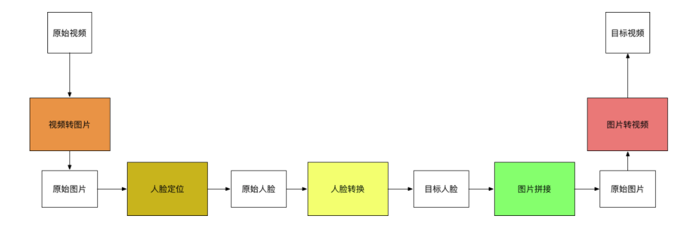
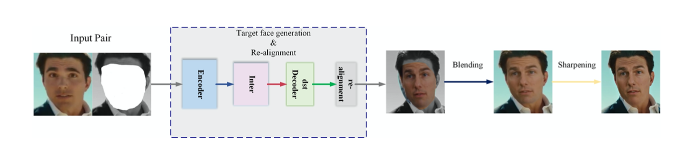

# Deepfake Basic

(参考里的原理讲解太过于浅显了，似乎无助于理解)

目前看起来是有两个方法找人脸：

1. HOG找到68个特征
2. 用CNN训练相关的模型

Q：

一个目标有多个框，那么如何去确定到底是哪个框呢，视频中的说法是找到置信度最大的那个，但是置信度怎么找得到的呢？？

Deepfake 的缺陷有：

* 在侧脸做的不好

## DeepFaceLab: A simple, flexible and extensible face swapping framework

Deepfacelab 已经在GitHub上提供了比较好的**Pipeline**（操作流水线）

本文的贡献有：

* A state-of-the-art framework consists of maturity pipeline is proposed, which aims in achieving photorealistic face swapping results.
* DeepFaceLab open-sources the code in 2018 and always keep up to the progress in the computer vision area, making a positive contribution for defending deepfakes both actively and passively, which has drawn broad attention in the open-source community and VFX areas.
* Some high-efficiency components and tools are introduced in DeepFaceLab hence users may want more flexibility in the DeepFaceLab workflow meanwhile find the problems in time.

### 驱动DeepFaceLab实现的原理： 

* The key motivation behind face manipulation techniques is **Generative Adversarial Networks (GANs)**

## Pipeline:
* Extraction

 Training

* Training

* Conversion

## Celeb-DF: A Large-scale Challenging Dataset for DeepFake Forensics

[Celeb-DF](2020-10-17-Celeb-DF.md)

## FaceForensics++: Learning to Detect Manipulated Facial Images

[FaceForensics++](2020-10-17-FaceForensics.md)

## Reference

[原理讲解](https://www.youtube.com/watch?v=y7XneJitOzw&ab_channel=BitTiger%E5%AE%98%E6%96%B9%E9%A2%91%E9%81%93BitTigerOfficialChannel)

[Github](https://github.com/Fabsqrt/BitTiger/tree/master/ArtificialIntelligent/DeepFake)

[实操](https://www.youtube.com/watch?v=lSM-9RBk3HQ&ab_channel=Deepfakery)

[Github](https://github.com/iperov/DeepFaceLab)

[paper](https://arxiv.org/abs/2005.05535)

[GAN的理解](https://zhuanlan.zhihu.com/p/33752313)

[什么是pipeline(计算机底层)](https://blog.woodcoding.com/%E8%AE%A1%E7%AE%97%E6%9C%BA%E5%9F%BA%E7%A1%80/2019/03/24/What-is-pipeline/)

[什么是pipeline(机器学习方面)](https://blog.csdn.net/qq_39521554/article/details/80653463)

