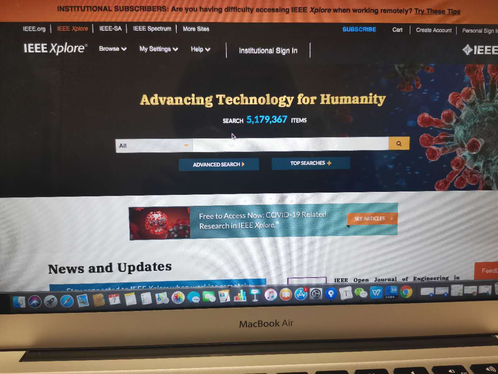
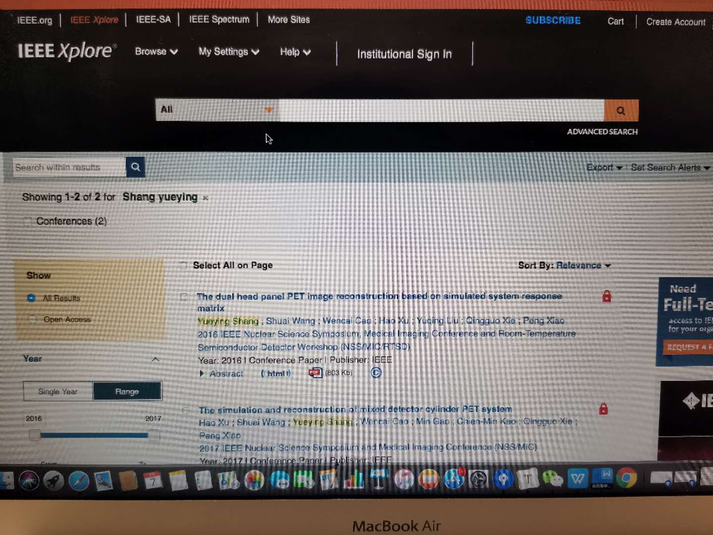
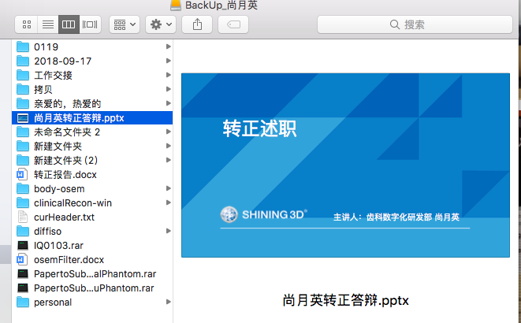
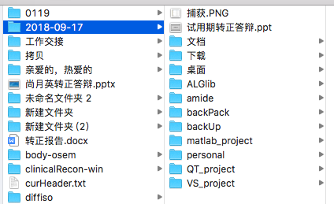
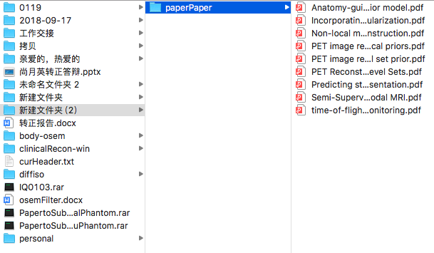
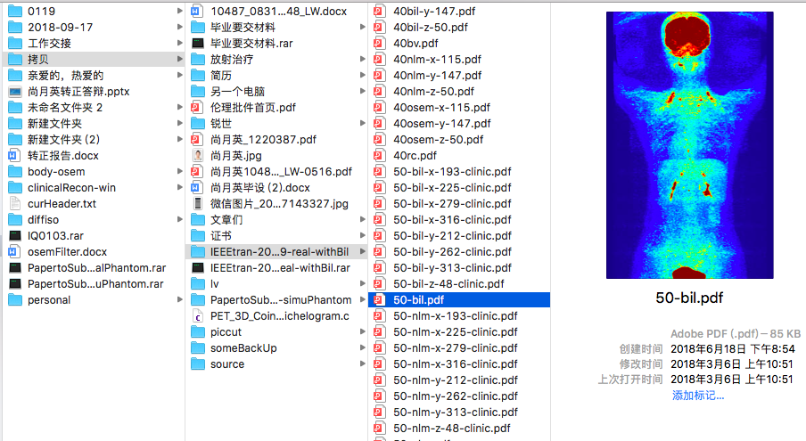
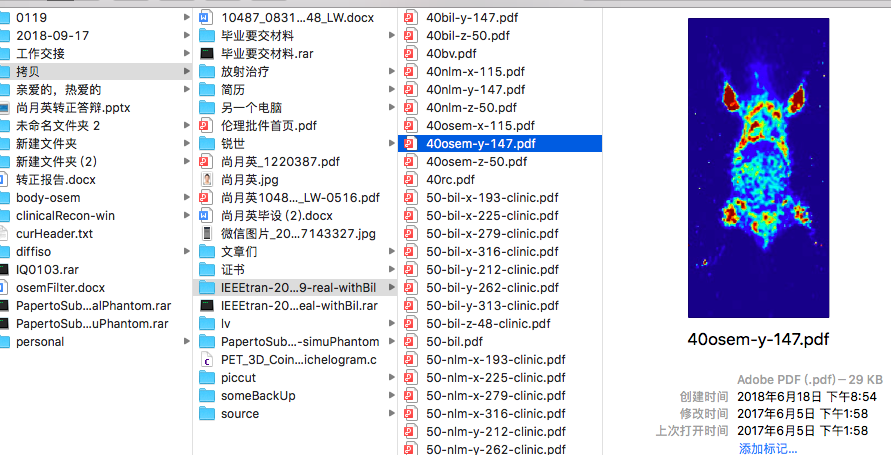
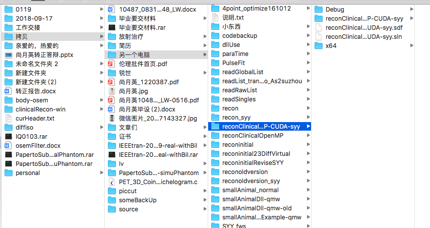

2020-05-07-recording.

I want to record the searching of this time.

Today, when I was translating one paper. I checked the Disk，I found the work I did when I was a student. I can not believe I can do that work, I can not believe I can write that papers. 

I wanted to check the format of the English paper I wrote, but I did not know how to search it suddenly.

I searched the IEEE several seconds later...

I found the paper I wrote...

the conference...

one paper I wrote almost for one year, but it can not make out...

Maybe the work is not great. But I did choose another way to go which I never had a touch of it. The work I do now is also challenging and now I'm learning how to use the tool well and then I can use it to make someting and to be someone.

And ZJ called at 11:10 pm to complain something of Professor Xie,  it sounds familiar and unfamiliar. And it reminds me of this thing again.

Can not tell which is better yet.

But the destination is the same, and maybe I will choose to go back to that way.

These several days I even want to know whether there has a chance for me to become a doctor...

maybe several years later, I will become a doctor, not that doctor...

I know that young girl is always there, never left, and now she is awake.

