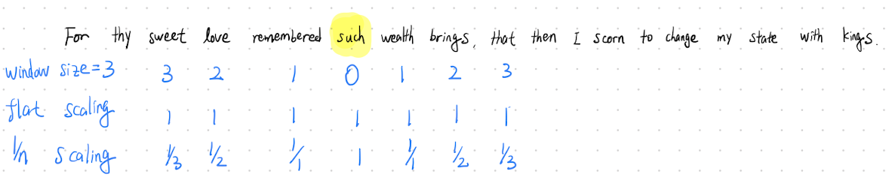

<!-- Add math equation API -->

CS224U: Natural Language Understanding 是我在Stanford AI Certification Program 里的第一节课。
这篇Blog对知识点和学习心得做一个简单的总结。

最近几学期这门课的教授一直是[Prof. Christopher Potts](https://web.stanford.edu/~cgpotts/)和[Bill MacCartney](https://nlp.stanford.edu/~wcmac/)，今年也不例外。两位都是真*巨佬，苹果的Siri就是Bill领导的产品之一。这学期因为COVID-19疫情的原因，无论是我们Online的学生还是Stanford的在校学生，课程都变成Online了，通过Zoom授课。这学期Online＋在校学生大概有120+人。我这学期作业是跟一个Stanford本科的白人小哥一组，final project 是我跟白人小哥哥加一个在 Northwestern 的CS PhD。然而个final project因为疫情也变成optional的了。

[课程官网](https://web.stanford.edu/class/cs224u/)

[2019年课程视频](http://onlinehub.stanford.edu/cs224u-natural-language-understanding)

# Lecture 1, Introduction and course overview

[Lecture 1 slides](https://web.stanford.edu/class/cs224u/materials/cs224u-2020-intro-handout.pdf)

## NLP VS. NLU
第一节课，老师简单做了一些自我介绍，然后介绍了一个**NLP**(Natural Language Processing)
和**NLU**(Natural Language Understanding)的不同。我的理解是NLU是NLP下的一个小分支，
NLU强调的机器对语言的理解，而NLP则强调对语言的处理。门课会涉及到*Grounded Language 
Understanding*，是一个典型的NLU问题。这门课用 *Pragmatic Color Describer* 来简单介绍了**Grounding**的概念。
当我用语言描述一个颜色的时候，我们所用的描述性词汇取决于周围的环境。有请我们的橘猫登场:

我们描述两只橘猫的时候，就可以用浅一点的那个只橘猫VS深色的橘猫来作区分。然而当对比的猫不是橘色的话，我们就需要描述橘色的深浅，只需要说橘猫即可。比如这样:

当我们使用对比描述语言的时候，我们假设说话对象对颜色深浅有跟我们一样的理解。这个理解就是**Grounding**。
有关*Pragmatic Color Describer*的具体内容后面会详细讲。

## A brief history of NLU
这部分老师简单介绍了一下NLU的发展历史

- 1966: Eliza 
- 1988: Latent Semantic Analysis
- 2011年1月: IBM Watson beats Jeopardy! Champions
- 2011年10月: Apple Siri launches in beta
- 2014年4月: Microsoft Cortana demoed
- 2016年5月: Google Assistant

## CS224u topics
随后介绍了一下这学期会cover的NLU topics，八个topic，每个topic两个lecture。内容还是相当丰富的。
1. Vector-space models
2. Sentiment analysis
3. Relation extraction
4. Natural Language Inference 
5. Grounding
6. Contextual word representations
7. Adversarial testing
8. Methods and metrics

随后教授介绍了各个方向的发展，并且介绍了一个本书*SUPERINTELLIGENCE - NICK BOSTROM*,
我读着觉得不错，主要讲的就是对AI的未来发展，和可能带来的相应的社会问题。没什么技术内容，用词简单，
有时间的朋友可以读读，当做练习英文也不错。

最后教授介绍了一下几个入门教程，包括设置课程的虚拟环境，PyTorch和Numpy的入门，等。强烈建议跟着教程设置一下虚拟环境，并克隆这门课的Github，有很多有用的东西。

[CS224U虚拟环境设置教程](https://nbviewer.jupyter.org/github/cgpotts/cs224u/blob/master/setup.ipynb)

# Lecture 2, Distributed word representations
这节课讲的就是NLP里面最基础，但相当重要的Word Vector。 Prof. Potts从最开始的Co-occurrence矩阵，讲到到GloVe和Word2Vec等方法。

Vector representation的思想，是深度学习里的一个核心思想，我们就经常开玩笑说，“万物皆可Embedding”。比如在零售业，每一个商品，每一个门店，都可以用一个高维向量来表示。同理我们也可以通过这种向量来研究商品之间的关系。中国零售大佬阿里巴巴，和美国零售Walmart，Amazon都在这方面有深入的研究，这里附上一篇有关Product2Vec的论文，有兴趣的同学可以读一下(
[Studying Product Competition Using Representation Learning](https://arxiv.org/pdf/2005.10402.pdf))。

现在Word vector representation已经是学术界默认的有效方法，然而其背后有着对语言学深刻的理解。这要追溯到这个语言学问题：**什么定义了一个词的意思？** 在这里的理解是，与这个词一同出现在一个句子的其他词定义了这个词的意义。

*You shall know a word by the company it keeps. - Firth (1957)*

*“distributional statements can cover all of the material of a language without requiring support from other types of information. - Firth (1957)*

最简单的Co-occurrence矩阵通过计算词汇同时出现的次数来反应词义信息。

## 如何构建Co-occurrence矩阵
Co-occurrence矩阵的构建有两个主要参数。
1. Window Size: 以一个单词为中心，前后考虑co-occurrence的范围
2. Scaling: 用于调整co-occurrence的数值

这里用莎士比亚的一句诗来举例:
"For thy sweet love remembered such wealth brings That then I scorn to change my state with kings."

这两个参数的选取，主要遵循以下逻辑
- 更大的window size和更平滑的scaling能获取更多的**semantic information**(语义信息)
- 更小的window size和更多的scaling能获取更多的**syntactic information**(句子结构信息)

<!-- 同样是**加班**，为什么有人就说他**工贼，福报，996**，有人却说他**努力，奋斗，有梦想**？这个 -->
## 如何比较两个向量
单词变成向量之后，我们需要系统的比较两个向量的方法。这门课介绍了以下几个方法：
1. Euclidean distance 
2. Euclidean distance with L-2
3. Cosine distance
4. Matching-based methods

### Euclidean distance(欧几里得距离)
n维向量u, v之间的距离:

$$ {euclidean(u, v)=\sqrt{\sum_{i=1}^{n}{|u_i - v_i|^2}}} $$

Euclidean distance描述的是两点之间的直线距离。如果两个向量方向一致，大小不同的话，欧式距离也会非常大。通常word vector的方向比大小更重要，方向一致的word vector通常有着相近的词意，所以Euclidean distance不是比较word vector的合适方法。

### Euclidean distance with L-2 norm
如果我们对向量进行归一化，那么向量大小都会变为1，这是用在用Euclidean distance就能排除向量大小的影响，从而只考虑向量方向的影响。

### Cosine distance
Cosine distance只测量向量角度，向量大小完全无关。Cosine distance是NLP界最常用的word vector比较方法之一。

<!-- $$ {cosine(u, v)=1 - \frac{{\sum_{i=1}^{n}{u_i \times v_i}}}{||u||_2 \times ||v||_2}} $$-->

### Matching-based methods