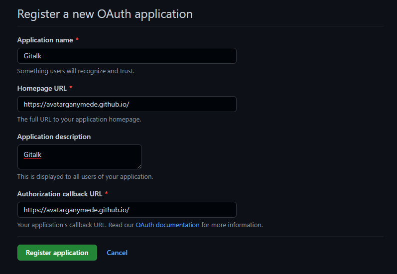

感谢[@BY]([qiubaiying (BY) (github.com)](https://github.com/qiubaiying))提供的详细教程，本博客才得以顺利搭建。详细教程参见 [《利用 GitHub Pages 快速搭建个人博客》](http://www.jianshu.com/p/e68fba58f75c)。

然而在实际搭建过程中，依然遇到了若干问题，在此记录自己的解决办法。

### 本地调试博客

安装过程就不说了，先装 ruby 再装 rubygems（详见[教程](https://www.jianshu.com/p/9f71e260925d)）。

然后项目初始化：

```shell
gem install jekyll
gem install jekyll bundler
```

但之后执行 `jekyll s` 以启动服务器时，出现了 `cannot load such file -- webrick (LoadError)` 的报错。查了很多资料未能解决，最后发现是我安装的 ruby 版本太高（3.0.1-1），不兼容 jekyll，重新安装低版本即可（推荐2.7.3-1）。

### 本地调试 Gitalk

点击[此链接]([New OAuth Application (github.com)](https://github.com/settings/applications/new))创建 GitHub Application，Application name 和 Application description 可以随便填，两个 URL 要填成自己博客主页的URL：



创建以后先点击 Generate a new client secret 按钮生成一个 Clients secret：


接下来的步骤按照开头提到的博客教程做即可。但在本地调试时，本机上的评论区显示了 `Error: Bad credentials`，经过广泛查询，出现该报错的原因是因为在本机（127.0.0.1:4000）初次进入页面时没有登陆 GitHub，access token 是 null，故而报错。配置好 Gitalk 后 push 然后用浏览器打开自己的博客，这条报错就会消失。