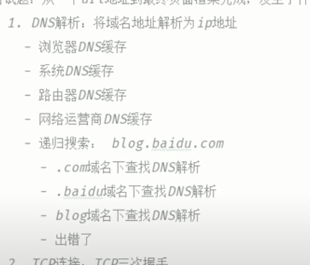

# 面试中的计网知识

#### 三次握手过程

https://www.youtube.com/watch?v=TEh6t8meORo

#### 三次握手，为什么是3次，而不是2次或4次？（其实是在问原理，但是怎么和第一个问题相区别）

https://blog.csdn.net/lengxiao1993/article/details/82771768 里面的图不错

因为三次握手后，C和S至少可以确认之前的通信情况，但无法确认之后的情况。 所以如果四次还是五次或是更多次都是徒劳的。

#### 什么是TCP， TCP是如何确保传输安全的？

Transmission Control Protocol 传输控制协议，是一种**面向连接(**连接导向)的、可靠的、 基于IP的传输层协议

保证安全可以参考：https://www.cnblogs.com/sunlong88/p/12845035.html

#### TCP和UDP的区别

最主要的区别在于：TCP 是面向连接的，UDP 是面向无连接的（可以理解成TCP是打电话，UDP是发邮件）

https://blog.csdn.net/zhang6223284/article/details/81414149

#### 输入一个URL，发生的过程

https://blog.csdn.net/wlk2064819994/article/details/79756669

https://www.youtube.com/watch?v=104KeTzLcak

#### DNS 域名系统

https://blog.csdn.net/codejas/article/details/80086068

#### HTTP和HTTPS的区别

HTTP： HyperText Transfer Protocol：超文本传输协议）

HTTPS：（Hypertext Transfer Protocol Secure：超文本传输安全协议）是一种透过计算机网络进行安全通信的传输协议。HTTPS 经由 HTTP 进行通信，但利用 SSL/TLS 来加密数据包。HTTPS 开发的主要目的，是提供对网站服务器的身份认证，保护交换数据的隐私与完整性。

https://www.runoob.com/w3cnote/http-vs-https.html

#### HTTPS的SSL（TLS）协议

https://www.jianshu.com/p/a7292b4db7bd

#### HTTPS的具体过程

https://www.jianshu.com/p/e30a8c4fa329

#### HTTP状态码

https://www.runoob.com/http/http-status-codes.html

#### 抓包的原理

https://blog.csdn.net/l61052319940708/article/details/80624900

#### 断点续传怎么做的

https://blog.csdn.net/zhangliangzi/article/details/51348755

#### 什么是子网掩码、它的作用是什么

https://blog.csdn.net/mao_hui_fei/article/details/83005940

#### post和get的异同

https://www.cnblogs.com/logsharing/p/8448446.html

## Reference

[计算机网络——TCP协议中的三次握手四次挥手以及11种状态转换](https://blog.csdn.net/a987073381/article/details/52206215)

