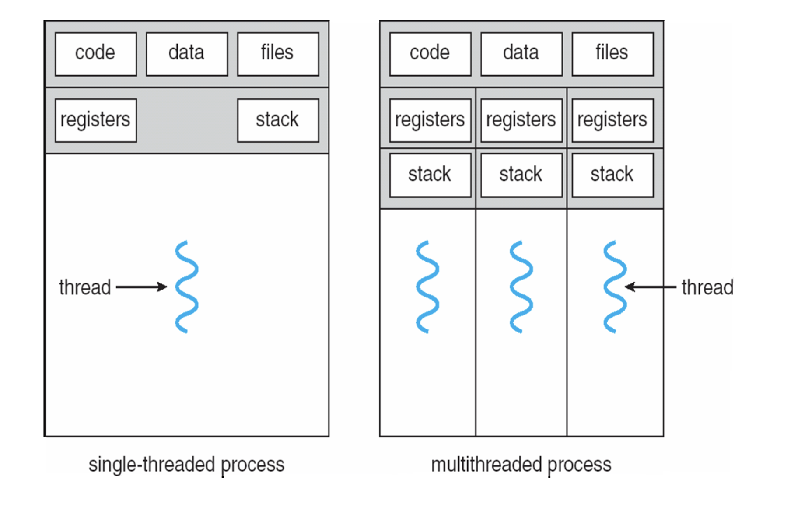

# 面试中的操作系统知识

#### 同步和互斥，锁

#### 举一个死锁的例子

#### 进程和线程的区别

**进程是资源分配的单元**，**线程是系统调度的单元**

转自https://www.zhihu.com/question/25532384

做个简单的比喻：进程=火车，线程=车厢

- 线程在进程下行进（单纯的车厢无法运行）
- 一个进程可以包含多个线程（一辆火车可以有多个车厢）
- 不同进程间数据很难共享（一辆火车上的乘客很难换到另外一辆火车，比如站点换乘）
- 同一进程下不同线程间数据很易共享（A车厢换到B车厢很容易）
- 进程要比线程消耗更多的计算机资源（采用多列火车相比多个车厢更耗资源）
- 进程间不会相互影响，一个线程挂掉将导致整个进程挂掉（一列火车不会影响到另外一列火车，但是如果一列火车上中间的一节车厢着火了，将影响到所有车厢）
- 进程可以拓展到多机，进程最多适合多核（不同火车可以开在多个轨道上，同一火车的车厢不能在行进的不同的轨道上）
- 进程使用的内存地址可以上锁，即一个线程使用某些共享内存时，其他线程必须等它结束，才能使用这一块内存。（比如火车上的洗手间）－"互斥锁"
- 进程使用的内存地址可以限定使用量（比如火车上的餐厅，最多只允许多少人进入，如果满了需要在门口等，等有人出来了才能进去）－“信号量”

#### 进程通信方式

https://www.cnblogs.com/LUO77/p/5816326.html

#### 线程的通信方式

https://blog.csdn.net/jisuanji12306/article/details/86363390

#### synchronized和volatile介绍

https://blog.csdn.net/Woo_home/article/details/102651639

#### 死锁的条件、解决方法

死锁有四个条件：

* 非抢占
* 循环等待
* 互斥
* 持有且等待

解决方法：

https://blog.csdn.net/guaiguaihenguai/article/details/80303835

可以去看看OS复习的那几个模型

#### 什么场景用互斥锁，什么场景用读写锁

https://www.jianshu.com/p/c99d3d851651

https://blog.csdn.net/chen134225/article/details/81835055

#### 乐观锁和悲观锁，各自的使用场景

https://blog.csdn.net/shanxiyaofeng/article/details/85100131

#### 说下生产者-消费者模型，其中的同步机制是怎么样的

可以参考OS复习资料

#### 什么是写优先和读写平衡

https://blog.csdn.net/william_munch/article/details/84256690

#### 什么是优先级反转，怎么解决

去看看OS的作业

#### 什么是抢占

#### 堆栈的异同

https://blog.csdn.net/K346K346/article/details/80849966

#### 什么是虚拟内存、共享内存、物理内存

https://blog.csdn.net/T146lLa128XX0x/article/details/100035743

#### 并行和并发的区别

**并发（Concurrent）**在操作系统中，是指一个时间段中有几个程序都处于已启动运行到运行完毕之间，且这几个程序都是在同一个处理机上运行。

**并行（Parallel）**当系统有一个以上CPU时，当一个CPU执行一个进程时，另一个CPU可以执行另一个进程，两个进程互不抢占CPU资源，可以同时进行，这种方式我们称之为并行(Parallel)。

### **并发和并行的区别**

并发，指的是多个事情，在同一时间段内同时发生了。   

并行，指的是多个事情，在同一时间点上同时发生了。

并发的多个任务之间是互相抢占资源的。   

并行的多个任务之间是不互相抢占资源的、

只有在多CPU的情况中，才会发生并行。否则，看似同时发生的事情，其实都是并发执行的。

https://cloud.tencent.com/developer/article/1424249

#### 系统如何提高并发性？

https://blog.csdn.net/u011550710/article/details/76687152