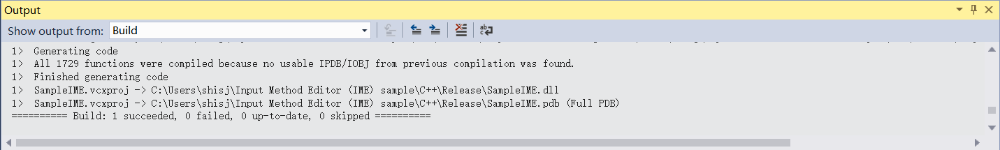
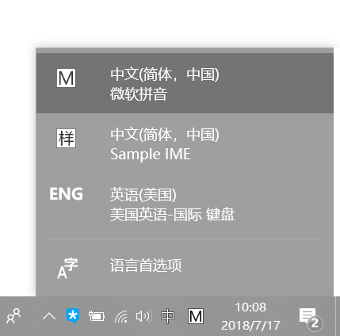

# 基于微软的开源SampleIme搭建自己的输入法

### 摘要

本文以微软官网的SampleIme开源代码为基础，讲述如何基于自定义的字典实现一款简易输入法

环境为Windows10 + vs2015（我也不知道怎么就被老师安排了这么个完全没有做过的东西 WIN32的学习路径是在是太陡峭了😭）

### Step1 

下载SampleIme源码

这里附上下载地址：https://code.msdn.microsoft.com/windowsdesktop/Input-Method-Editor-IME-b1610980

或者我的rep：https://github.com/NJUSSJ/SampleIme

### Step2

这里提供两条实现路径，一条路径是基于InstallerShield大将源码打包成安装文件；另一条路径是基于ddl文件手动注册输入法。

### 这里我们首先讲述第二条路径：

	#### 1.

在vs中打开刚刚下载的SampleIme项目（即项目中的.sln文件），接下来分别在Release WIN32和Release x64的构建条件下build Project。

这时你会发现，编译报错以及可能会出现链接错误，这是由于编译器的版本差异导致的，下面讲述如何解决这些问题进行正确编译。

***首先，在Solution Explorer视图中选择SampleIme右击选择Properties，进入properties dialog -> C/C++ -> General 将treat warning as errors 选项修改为No***

***其次，还是在刚刚的properties dialog -> Linker -> General 将Enable Incremental Linking 选项改为Yes***

***接下来，进入Linker -> Optimization 将References选项修改为Yes***

这时候我们再次在两个不同的构建条件下进行编译

编译成功！！

#### 2.

下面我们到资源管理器中找到项目你x64文件夹下的Release中的SampleIme.dll文件将其复制到C:\Windows\System32文件夹下；同理在项目的Release文件夹下将WIN32条件下编译的SampleIme.dll文件复制到C:\Windows\SysWOW64 文件夹下。

之后我们在SampleIme文件夹下找到Dictionary文件夹，里面有一份拼音码表，有兴趣的胖友可以打开熟悉以下码表的形式。我们将这份码表分别复制到刚刚提到的两个文件夹下（C:\Windows\System32 **&** C:\Windows\SysWOW64）

#### 3. 

以管理员权限打开cmd

然后键入这行命令：regsvr32 sampleIme.dll

然后退到上层文件夹（cd ..）

进入SysWOW64（cd SysWOW64）

同样运行这行命令：regsvr32 sampleIme.dll

出现上图，说明注册成功。

这时你会发现你的输入法中出现了Sample IME！*★,°*:.☆(￣▽￣)/$:*.°★* 。

随意打开一个编辑器尝试一下把。

### 利用InstallerShield生成安装软件：

btw，这个方法对于我这里安装的vs 2015 community不适用了，因为已经没有了默认的InstallerShield模板

需要安装Ultimate版本或者vs2013

安装后参照以下步骤：

#### 1.

- On the **File** menu, point to **New** and select **Project**. The **New Project** dialog opens.
- In the left pane, navigate to **Templates > Other Project Types > Setup and Deployment**, click **Enable InstallShield Limited Edition**, and click **OK**. Follow the installation instructions.
- Restart Visual Studio 2013.

#### 2.

- Open the IME solution (.sln) file.
- Build the solution（**Attention！！! in the mode of Debug WIN32**）.

#### 3.(这步的一些内容怎么开心怎么写就好...😊)

- In Solution Explorer, right-click the solution, point to **Add**, and select **New Project**. The **Add New Project** dialog opens.
- In the left tree view control, navigate to **Templates > Other Project Types > InstallShield Limited Edition**.
- In the center window, click **InstallShield Limited Edition Project**.
- In the **Name** text box, type "SetupIME" and click **OK**.
- In the **Project Assistant** dialog, click **Application Information**.
- Fill in your company name and the other fields.

#### 4.

- Click **Application Files**.
- In the left pane, right-click the **[INSTALLDIR]** folder, and select **New Folder**. Name the folder "Plugins".
- Click **Add Files**. Navigate to **SampleIME.dll**, which is in the **C++\Debug folder**, and add it to the **Plugins** folder. **Repeat** this step for the IME dictionary, which is in the **C++\SampleIME\Dictionary folder**.

#### 5.（Do not forget this!）

- Right-click the IME DLL and select **Properties**. The **Properties** dialog opens.
- In the **Properties** dialog, click the **COM & .NET Settings** tab.
- Under **Registration Type**, select **Self-registration** and click **OK**.

#### 6.

- Build the solution. The IME DLL is built, and InstallShield creates a setup.exe file that enables users to install your IME on Windows 10. The **setup.exe** file is located in the **SetupIME\SetupIME\Express\DVD-5\DiskImages\DISK1** folder.

### ps:

demo中提供的码表为全拼码表

这里我处理了一份五笔的码表以供参考（https://github.com/NJUSSJ/SampleIme/tree/master/C%2B%2B/SampleIME/Dictionary）

只需要将源码中define.h头文件中对应的字典文件名修改，以及上述步骤中的相应字典文件做个替换就可以了，其他步骤一样。