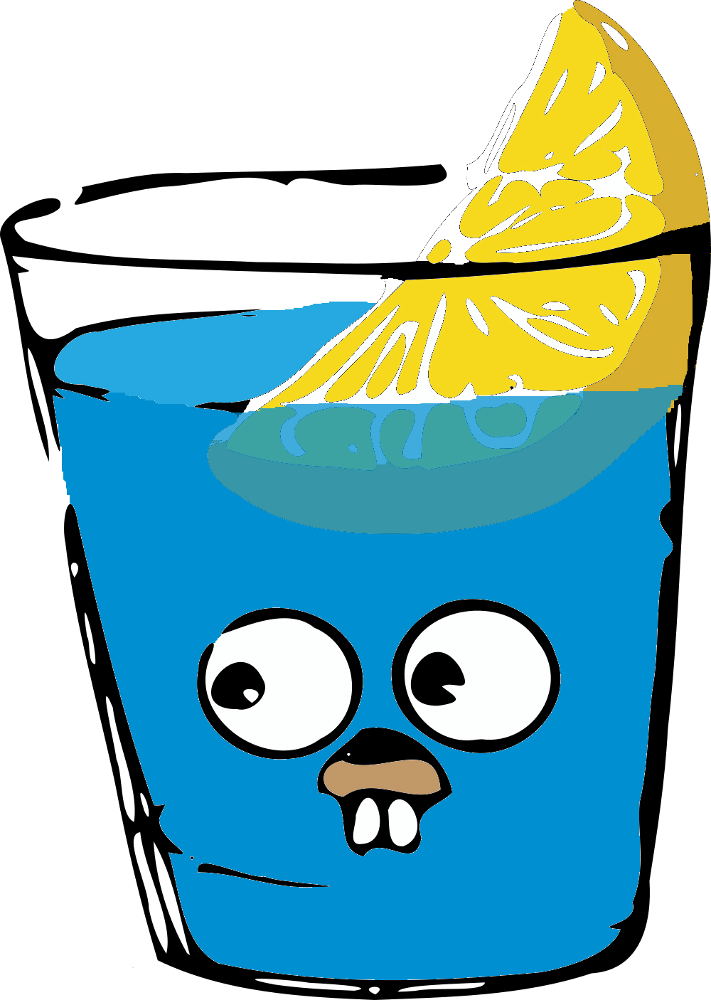
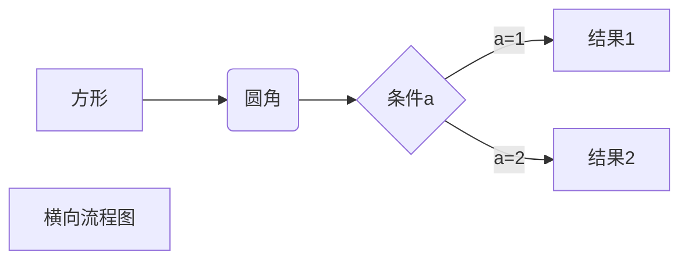
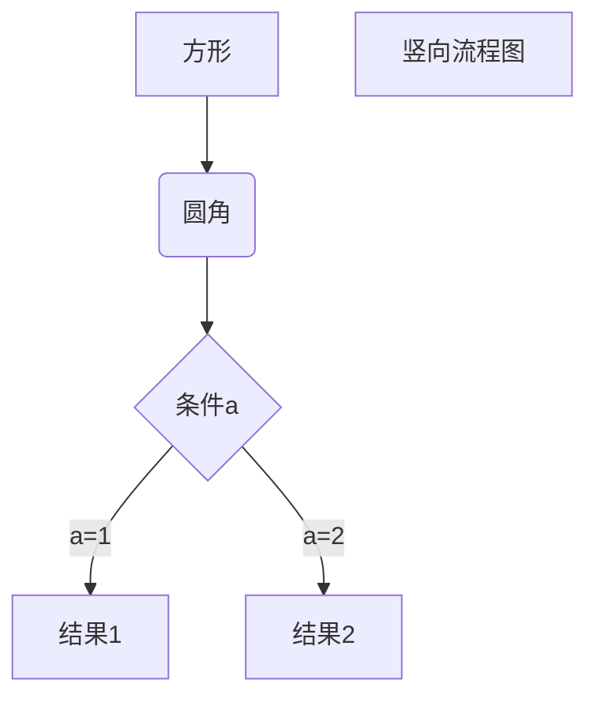

# 手动多个空行
<br>
<br>
<br><br>
<br><br>
<br><br>
<br><br>
<br/>


# 用于锚点的标题

line2
line2-1  
line3

line4

line5
    bokuniha

- 一级标题1
  - 二级标题1
  - 二级标题2
  - 二级标题3
- 一级标题2

1. 有序一级
   1. 有序二级


行末有一个空格 
行末有两个空格  
反斜杠换行 \
看起来并不支持，手动多按一个回车

仍然是两行，只是行距变大

[锚点](#用于锚点的标题 "标题")  

[github首页](http://github.com)

| col1 | col2 | col3 |
| :--- | :---: | ---: |
| id | score | manager|
| 1123| 2222 \\| xxxx |


另一种一级标题
===========

另一种二级标题
-------


*斜体*
**粗体**
***粗斜体***

这是一条分割线
******

这里试一下脚注 [^脚注本身]  

[^脚注本身]: 好像失败了

行内代码`printf`

    int i = 1
    printf()

```golang
fmt.Println()
```

这个链接用 1 作为网址变量 [RUNOOB][1].
然后在文档的结尾为变量赋值（网址）

[1]: http://static.runoob.com/images/runoob-logo.png

Markdown 还没有办法指定图片的高度与宽度，如果你需要的话，你可以使用普通的 \ 标签。


> 引用  
> xh
> > 第二级引用
> > 里面空格也是md的解释方式

[markdown高级技巧](https://www.runoob.com/markdown/md-advance.html)  
包括使用html元素，用$$插入公式





```flow
st=>start: 开始框
op=>operation: 处理框
cond=>condition: 判断框(是或否?)
sub1=>subroutine: 子流程
io=>inputoutput: 输入输出框
e=>end: 结束框
st->op->cond
cond(yes)->io->e
cond(no)->sub1(right)->op
```

```flow
st=>start: 开始框
op=>operation: 处理框
cond=>condition: 判断框(是或否?)
sub1=>subroutine: 子流程
io=>inputoutput: 输入输出框
e=>end: 结束框
st(right)->op(right)->cond
cond(yes)->io(bottom)->e
cond(no)->sub1(right)->op
```

```sequence
对象A->对象B: 对象B你好吗?（请求）
Note right of 对象B: 对象B的描述
Note left of 对象A: 对象A的描述(提示)
对象B-->对象A: 我很好(响应)
对象A->对象B: 你真的好吗？
```

```sequence
Title: 标题：复杂使用
对象A->对象B: 对象B你好吗?（请求）
Note right of 对象B: 对象B的描述
Note left of 对象A: 对象A的描述(提示)
对象B-->对象A: 我很好(响应)
对象B->小三: 你好吗
小三-->>对象A: 对象B找我了
对象A->对象B: 你真的好吗？
Note over 小三,对象B: 我们是朋友
participant C
Note right of C: 没人陪我玩
```

```mermaid
%% 时序图例子,-> 直线，-->虚线，->>实线箭头
  sequenceDiagram
    participant 张三
    participant 李四
    张三->王五: 王五你好吗？
    loop 健康检查
        王五->王五: 与疾病战斗
    end
    Note right of 王五: 合理 食物 <br/>看医生...
    李四-->>张三: 很好!
    王五->李四: 你怎么样?
    李四-->王五: 很好!

    ```mermaid
%% 语法示例
        gantt
        dateFormat  YYYY-MM-DD
        title 软件开发甘特图
        section 设计
        需求                      :done,    des1, 2014-01-06,2014-01-08
        原型                      :active,  des2, 2014-01-09, 3d
        UI设计                     :         des3, after des2, 5d
    未来任务                     :         des4, after des3, 5d
        section 开发
        学习准备理解需求                      :crit, done, 2014-01-06,24h
        设计框架                             :crit, done, after des2, 2d
        开发                                 :crit, active, 3d
        未来任务                              :crit, 5d
        耍                                   :2d
        section 测试
        功能测试                              :active, a1, after des3, 3d
        压力测试                               :after a1  , 20h
        测试报告                               : 48h
```

[ ] 任务列表

- [ ] 未完成任务
- [x] 已完成任务 

